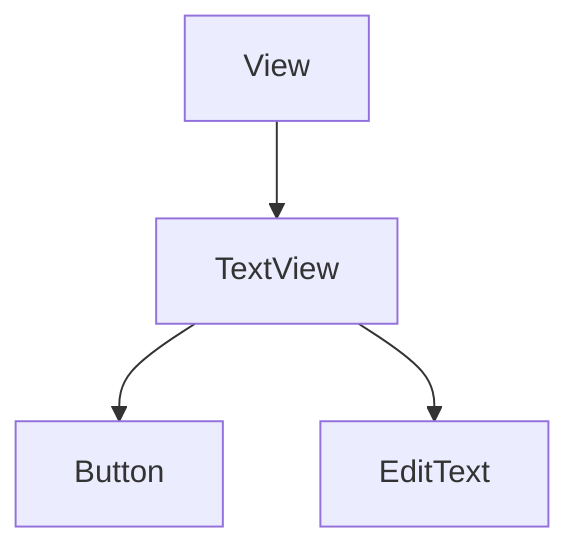
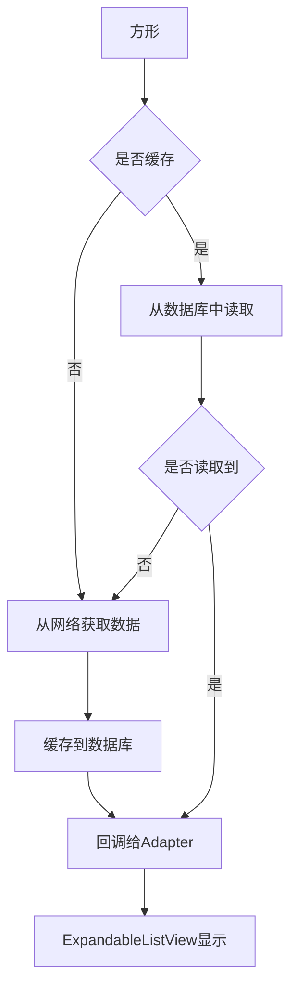
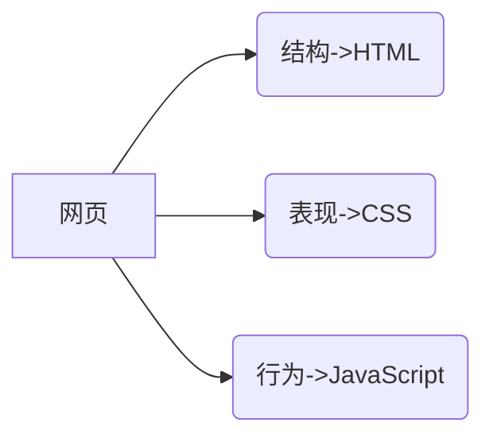

# Android

## UI基础入门

###  Android 入门&AS


android系统框架


| 工具           | 工作区间  | 工程    |
| -------------- | --------- | ------- |
| eclipse        | workspace | project |
| android studio | project   | module  |


Gradle

- Android主流的编译工具
- Gradle中的部分配置
  - minSdkVersion：最小API level
  - compileSdkVersion：编译的SDK版本
  - targetSdkVersion：目标版本
  - dependencies：依赖配置，依赖的库

AS常用技巧

- 快捷键的设置：keymap-class name Completion

- 常用快捷键

  - 格式化代码：ctrl+alt+l
  - 撤销：ctrl+z 反：Ctrl+Shift+z
  - 提示代码：ctrl+a+空格
  - 代码自动修正：alt+enter
  - 显示文档说明：ctrl+q
  - 查找：ctrl+f
  - 按关键字进行全局搜索：ctrl+shift+f

  

  

常见问题-中文乱码问题

setting->File Encodings

IDE Encoding 

Project Encoding

File or Diector Encoding和Property File Enconding 

单个java右键File Encoding


bulid gradle中

complieOptions{econding"GBK"}


### Android线性与相对布局

Acitvity

- MainActivity

- onCreate(程序的入口)

- setContentView(设置内容视图）

- R：为每一个资源文件按类别分配一个索引

  使程序员可以通过R.类名.资源名去操作对应的资源布局文件layout

清单文件 AndroidManifest.xml


布局

布局是指对界面结构的全面规划与安排，通过api中提供的各种布局能过快速的完成对界面的设计

布局的种类：

- 线性布局（LinearLayout）
- 相对布局（RelativeLayout）
- 帧布局（FrameLayout）
- 表格布局（TableLayout）
- 网格布局（GirdLayout）
- 约束布局（ConstraintLayout）

添加布局：

- 利用xml文件设计

- 使用java代码添加（不常用）

  


### UI基础控件

View

- 处理文本内容的View（TextView）
- 被点击的View(Button)
- 处理图片内容的View(（ImageView）
- 接收用户信息输入的View（EditText）
- 进度条类的View（PogressBar）

#### 通用属性

|         属性         |          常用可选值           |
| :------------------: | :---------------------------: |
| android:layout_width |  match_parent 填充整个父容器  |
| android:layout_heigh | wrap_content 根据所含内容确定 |
|                      |     正整数单位dp 精确大小     |
|                      |                               |
|      android:id      |  @id/valName 使用已存在的id   |
|                      |    @+id/valName 添加新的id    |

|                        |                                         |
| :--------------------: | :-------------------------------------: |
| android:layout_margin  |  正整数单位dp  和相邻控件或边缘的距离   |
|    android:padding     | 正整数单位dp 控件内容距离控件边缘的距离 |
|   android:background   |      十六进制的颜色值 颜色作为背景      |
|                        |     @mipmap/resourceId 图片作为背景     |
|                        |                                         |
| android:layout_gravity |       center_horizontal 水平居中        |
|    android:gravity     |        center_vertical 垂直居中         |
|                        |           center 水平垂直居中           |
|                        |        left、right、top、bottom         |

|                    |                                      |
| ------------------ | ------------------------------------ |
| android:visibility | visible 可见状态                     |
|                    | invisible 不可见状态，但保留控件位置 |
|                    | gone 不可见状态，也不保留位置        |


#### TextView

继承关系



能完成的效果：

- 对长文本进行显示处理(在string_xml定义文本资源，调用)

- 支持Html代码

- 内容有样式，链接效果

  android:lineSpacingMultiplier="2" 倍距

  android:lineSpacingExtra="20sp"


EditText

- android:inputType 输入类型
- android:hint 提示信息
- android:maxLength 长度


Button

Button注册点击事件的方法

- 自定义内部类

- 匿名内部类

- 当前Activity去实现事件接口

- 在布局文件中添加点击事件属性

  实例button Button=findView(R.id.btn);

  1.自定义内部类（有多个按钮操作一样）

  ```java
  //点击事件，被点击时触发的事件
  btn.setOnClickListener(new My.......); 设置点击事件的监听器，实时监控点击发生
  class MyClickListener implements View.OnClickListener{
      @Override
      public void onClick(Veiw view){
          //在控制台输出一条语句
          Log.e(tag:"TAG",msq:"刚刚点击的按钮时注册了内部类监听器对象的按钮");
      }
  }
  ```

  

  2.匿名内部类（有唯一操作的按钮）

  ```java
  btn.setOnClickListene(new View.OnClickListener(){
  
  ​	@Override
  
  ​	public void onClick(View view){
  
  ​		//在控制台输出一条语句
  
  ​		Log.e(tag:"TAG",msq:"刚刚点击的按钮时注册了内部类监听对象的按钮");
  
  ​	}
  
  });
  ```

  

  3.当前Activity去实现事件接口

  ```java
  public class ButtonActivity extends AppCompatActivity implements View.OnClickListener
  ```

  

  4.在布局文件中添加点击事件属性（常用）

  ```xml
  android:onClick="方法名"
  ```

  

  ```JAVA
  //view:被点击的控件对象（多个按钮不同事件可采用判断集中实现）
  public void myClick(View v){
      
  }
  ```


ImageView

用来显示和控制图像的控件，可以对它进行放大、缩小、旋转等操作

常用属性有:

- android:src=" " 指定前景图片资源

- android:background 设置背景

  drwable 

  mipmap：缩放程度效果较好

  ImageButton 结合图片和按钮


ProgressBar

进度条，默认情况下是圆形，没有刻度，只是一个不断旋转的动画效果。通过设置style，可以显示传统的水平带刻度的进度条

```xml
style=" " 设置风格
android:progress="" 设置进度
android:max=""  设置最大值  默认100
android:indeterminate="ture" 设置进度条是否一直滚动
```


```java
final ProgressBar progressBar = findViewById(R.id.progress);
ProgressBar.setProgress(80);
//在Android中，4.0以后不能直接在线程中控制。进度条是个特例
new Thread(){
    @Override
    public void run(){
        for(int i=1;i<100;i++){
            progressBar.setProgress(i);
            try{
                Thread.sleep(millis:30);
            }catch(InterruptedException e){
                e.printStackTrace();
            }
        }
    }
}.start();
```


### Android部分布局&约束布局

| 帧布局(FrameLayout) | 重要属性                           |
| ------------------- | ---------------------------------- |
|                     | android:layout_gravity(控制重力)   |
|                     | android:foreground(前景)           |
|                     | android:foregroudGravity(前景重力) |


| 表格布局(TableLayout) | 重要属性                                              |
| --------------------- | ----------------------------------------------------- |
|                       | android:stretchColumns   可伸展                       |
|                       | android:stretchColimns="x,x...." 让某些列伸展填充屏幕 |
|                       | android:shrinkColumns 可收缩                          |
|                       | android:collapseColumns 可隐藏                        |

如果直接在其中添加控件，那么控件将和父容器等宽

想让控件出现在同一行，在这些控件外层加一对<TableRow> ，宽度默认wrap_content


| 网格布局(GirdLayout) | 重要属性                                 |
| -------------------- | ---------------------------------------- |
|                      | android:rowCount(行数量)                 |
|                      | android:columnCount(列数量)              |
|                      | android:layout_column(位于第几列)        |
|                      | android:layout_rowSpan(跨几行)           |
|                      | 配合layout_graviry=“fill” 写入具体控件中 |


| 约束布局(ConstraintLayout) | 重要属性                                                     |
| -------------------------- | ------------------------------------------------------------ |
| 通过可视化的方式           | app:layout_ constraintBottom_ toBottomOf (约束当前view的底部位置) |
|                            | <!--app:ayout_constraintHorizontal_bias 水平偏移量，取值0~1 ,默认0.5--> |


inspector(属性区域设置)

自动约束的添加  Guidelines(添加基线参照物)


### 基础控件

#### CheckBox

- 系统封装的复选控件

- 两种状态：选择和未选中setChecked()

  isChecked(); 获取它的状态

- 监听状态变化:setOnCheckedChangeListener

  


#### RadioButton

- 单选控件

- 可以和RadioGroup一起使用，只能选择一个

- 和CheckBox的区别

  - 通过点击无法变未选中

  - 一组RadioButton只能同时选择一个

  - 在大部分ui框架中默认都以圆形表示

    

#### ToggleButton

- 切换程序中的状态

- 两种状态

  - android:textOn
  - android:textOff
  - setChecked(boolean)

- setOnCheckedChangeListener

  


#### SeekBar(进度条)

- 使用场景

- 简单使用与事件监听

  - setProgress
  - setOnSeekBarChangeListene

- 注意事项

  

  

## UI常用组件

### Activity入门

前台界面，用户所能看到的界面，展示、提供交互

创建

- 继承AppCompatActivity

- 在AndroidMainfes中注册

  ```xml
  	android:label=""  指定标签名
  	主入口声明：
  	<intent-filter>
  	<action android : name="android. intent.action.MATN"/>  <!--主要的启动应用-->
  	<category android : name= " android. intent . category. LAUNCHER" /> <!--可以从LAUNCHER打开-->
  	</ intent-filter>
  
  ```


Acticity与Layout之间的关系

- 在Acticity中，setContentView(R.layout....)实现Activity与Layout的关联


Acticity与View之间的关系

- 通过findViewById将layout中的控件找出来，并转化为View

- 点击事件：

  ```java
  		Button button=……;
  		button.setOnClickListener(new View.OnClickListener(){
  			@Override
  			public void onClick(View v){
  			}
  		}
  		);
  ```


Activity之间的跳转

```java
Intent intent=new Intent(TestActivity.this,NewActivity.class);  //意图从test到new
startActivity(intent);  //实现意图，将意图发送出去，实现跳转

```


栈：先进后出


Activity的四种启动模式

- standard 系统默认
- singleTop
- singleTasl
- singleInstance

1、standard

 可以有多个栈，谁启动它在谁的栈里


2、singleTop

顶部复用


3、singleTask

只有一个


4、singleInstance

单列，独栈性，全局只有一个


在AndroidMainfes中设置

android:launchMode=""

代码中设置

intent.addFlags(Intent.  );


### Android菜单创建和使用

3.0以前的menu

​	在Android3.0，当用户按“菜单”按钮时，选项菜单的内容会出现在屏幕底部,如图1所示,可包含多达6个菜单项，超出部分则以"更多”来显示。


3.0以后的menu

​	在Android3.0及更高版本的系统中,选项菜单中的项目将出现在操作栏中,用户通过操作栏右侧的操作或者点击设备菜单按钮来溢出菜单图标。


Menu分类

- 选项菜单(OptionMenu)
- 上下文菜单(ContextMenu)
- 弹出菜单(PopupMenu)


#### 1、选项菜单(OptionMenu)

选项菜单是一个应用的主菜单单项，用于放置产生全局影响的操作。


创建 

src->new android resource directory->选择menu->new menu resource file

```xml
<menu xmlns:android="http://schemas.android.com/apk/res/android">
    <item android:title="保存"/>
    <item android:title=“设置"/>
    <item android:title="更多操作”>
        <menu >
            <item android:title="子菜单1"/>
            <item android:title="子菜单2"/>
            <item android:title="子菜单3”/>
        </menu>
	</item>
</menu>
```

常用属性

android:icon="@mipmap/...."显图标

app:showAsAction="always" 直接显示在操作栏

always|withText 显示文本和图标

never不显示  ifRoom有空间就显示


java文件中创建

```java
public boolean onCreateOptionsMenu(Menu menu) {
    //加载菜单资源
    getMenulnflater().inflate(R.menu.option,menu);
    return true;
}
		
//OptionMenu菜单项的选中方法
public boolean onOptionsltemSelected(Menultem item) {
    switch(item.getItemId()){
        case.....
			.....
    }
    return super.onOptionsltemSelected(item);
}

```

#### 2、上下文菜单(ContextMenu)

长按某个view不放，就会出现在屏幕中间弹出ContextMenu


```java
//1、注册
registerForContextMenu(findViewById(R…..))  绑定在指定的view下
	
//2、创建
onCreateContextMenu{
    getMenulnflater().inflate(R.menu.context.menu);
}
	
//3、菜单的操作
public boolean onContextltemSelected(Menultem item){
    item.getItemId
}
	
//4为按钮设置上下文操作模式（菜单不出现在中间，在操作栏实现）
//(1)实现ActionMode CallBack
ActionMode.CallBack cb=new ActionMode.CallBack(){
//启动上下文操作模式时调用
    onCreateActionMode{
        getMenulnflater().inflate(R.menu.context.menu);
        return ture;
    }
    //创建方法后
    onPrepareActionMode
    
    //点击事件
    onActionltemClicked
			
	//结束时被调用
	onDestroyActionMode
}
	
//(2)在view的长按事件中去启动上下文操作模式
findViewByld(R.id. ctx btn).setOnLongClickListener(new View.OnLongClickListener(){
    @Override
    public boolean onLongClick(View view) {
        startActionMode(cb);
        return false;
    }
});


```


#### 3、弹出菜单(PopupMenu)

一个模态形式展现的弹出风格的菜单，绑定在某个View上，一般出现在被绑定的View的下方


```java
final Button button = findViewById(R.id.popu_btn);
popuBtn.setOnClickListener(new View.OnClickListener(){
    @Override
    public void onClick(View view){
        //（1）实例化PopupMenu对象（参数2：被锚定的view）
        PopupMenu menu=new PopupMenu(context:MainActivity.this.popupBtn);
        //(2)加载菜单资源：利用Menulnflater将Menu资源加载到PopupMenu.getMenu()所返回的Menu对象中
        //将R.menu.xx对于的菜单资源加载到弹出式菜单中
        menu.getMenuInflater().inflate(R.menu.xx,menu.getMenu());
        
        //（3）为PopupMenu设置点击监听器
        menu.setOnMenuItemClickListener(new PopupMenu.OnMenuItemClickListener(Menultem menultem){
            @Override
            public boolean onMenultemClick(Menultem menultem){
                switch(menultem.getIntemId()){
                    case R.id.copy:
                        Toast.makeText();
                        break;
                }
                return false;
            }
        });
        
        //4、显示PopupMenu
        menu.show();
    }
        
        

```


### Android对话框的处理

消息提示机制，常用于向用户传递信息、提示或警告用户的行为。


#### AlerDialog

常用方法有：

- setTitle
- setMessage
- create
- show


第一种

```java
//1.实例化一个BuiLder
//ALertDialog的构造方法是protected
AlertDialog.Builder builder = new AlertDialog.Builder( context:this);
//2.设置对话框样式
builder.setTitle("提示");//标题
builder.setMessage("您确定退出程序吗?");//提示语句1
builder.setPositiveButton( text:"确定",new DialogInterface.onclickListener() {
	@Override
    public void onclick(DialogInterface dialogInterface，int i) {
        finish();
    }
});
builder.setNegativeButton(text:"取消", listener: null);
//3.展示
builder.show( );

```


第二种

```java
public void showNormalDialog(){
    AlertDialog dialog = new AlertDialog.Builder( context:this).create();
    dialog.setTitle("提示");
    dialog.setMessage("您确定退出程序吗?");
    dialog.setButton(DialogInterface.BUTTON_POSITIVE,text:"确定", new DialogInterface.OnClickListener(){
        @Override
        public void onClick(DialogInterface dialogInterface,int i) {
           
        }
    });
}


```


#### 自定义对话框

1、设置布局

dialog_layout.xml

新建一个MyDialog类

```java
public class MyDialog extends Dialog{
	public MyDialog(@NonNull Context context){
        super(context);
        //为对话框设置布局
        setContentView(R.layout.dialog_layout);
	}
}
```


2、设置Style

Style.xml 去除标题栏、背景

```xml
<style name="mydialog" parent="android:style/Theme.Dialog">
    <item name="android:windowNoTitle" >true</item>
    <item name="android:windowBackground" >@android:color/transparent</item></style>
```

使用

```java
public MyDialog(@NonNul Context context,int themeResId){
    
}

System.exit(status:0); //程序结束
dismiss(); //对话框消失

```


3、自定义Dialog

实例化（环境上下文，style);


4、显示


####  PopupWindow（弹窗）


使用步骤：

- 创建PopupWindow对象实例
- 设置背景、注册事件监听器和添加动画
- 显示PopupWindow

```java
public void showPopupwindow(view view) i
//准备弹窗所需要的视图对象
View v = LayoutInflater.from(this).inflate(R.layout.popup_layout, root:nul1);
//1.实例化对象
//参数1:用在弹窗中的View
//参数2、3:弹窗的宽高
//参数4(focusable) :能否获取焦点
Popupwindow window = new Popupwindow(v, width: 190, height: 35,focusable:true);

//2.设置（背景、动画)

//3.显示
}
```


动画

1、创建动画资源

创建anim资源文件夹，新建资源文件

```xml
<set xmlns:android="http://schemas.android.com/apk/res/android">
    <translate
               android:fromXDe1ta="0"
               android:toXDelta="0"
               android:fromYDelta="300"
               android:toYDelta="0"
               android:duration="2000"
               ></translate>
</ set>

```

2、创建一个style应用创建的动画资源

```xml
<style name="translate_anim">
	<item nanme="android:windowEnterAnimation">
        @anim/translate
    </item>
</style>
```


3、对当前弹窗的动画风格设置为第二步风格的资源索引

```java
windw.setAnimationStyle(R.style.translate_anim);
```


#### ArrrayAdapter

数组适配器，只能用来显示单一的文本

```
//构造方法
	ArrayAdapter(Context context,int resource,int textviewld,List<T> objects)	
```


```java
private void showArrayDialog(){
    final String] items = {"Java" ,"Mysql","Android","HTML","C","JavaScript"};
    //数组适配器
    //参数1:环境
    //参数2∶布局资源索引﹐指的是每一项数据所呈现的样式android.R.layout.xx
    //参数3∶数据源
    ArrayAdapter adapter = new ArrayAdapter(this,android.R.layout.simple_dfopdown_item_1linejitems);
    AlertDialog.Builder builer = new AlertDialog.Builder(this)
        .setTitle("请选择")
        //参数1∶适配器对象(对数据显示样式的规则制定器)
        //参数2∶监听器
        .setAdapter(adapter,null);
    builer.show();
}

```

自定义资源

自定义布局文件

### Activity生命周期

- onCreate()  //创建
- onStart()  //开始
- onResume() //可以和外界交互
- onPause() //  暂停
- onStop() //停止
- onDestroy() // 销毁
- onRestart()  //停止的重新开始


//页面之间传值

1、

intent.putExtra()  传 

getIntent().getSringExtra()  接收  

 

2、

Bundle替代intent 类似hashmap 可传很多值

Bundle bundel=getIntent().getBundleExtra();

String a=budel.getString();

 

 

3、序列化一个对象

class User implements Serializable

 内部类也要序列化

 

4、返回时传值

B页面：setResult();

A页面打开方式：startActivityForResult(intent,请求值 )

在onActivityResult中处理返回结果

 

### Fragment

#### 设计思想

为什么需要Fragment


二、Fragemt VS Activity

- Fragment是到Android3.0+以后
- 一个Activity可以运行多个Fragemt
- Fragment不可能脱离Activity而存在
- Activity是屏幕的主体，而Fragemt是Activity的一个组成元素

生命周期


三、静态加载vs动态加载

1、静态加载：xml

- 创建一个activity加载一个布局文件
- 这个布局文件里写fragment
- mainActivity设置点击跳转activity stratActivity(new Intent(,));

2、动态加载

java code 

什么时机使用

- contaniner在activity里放视图布局

- 创建一个fragment

- 开启一个事务

  ```java
  getSupprtFragmentManager()
  			.beginTransaction()
  			.add(R.id.,fragment)
  			.commit();
  
  ```


四、如何传值

- Activity>Fragment传值

  - setArguments
  - 其.....

  类方法

- Fragment>Activity传值

  Callback

  接口


### ViewPager

应用场景：

- 引导界面、相册多图片预览
- 多Tab页面、App导航
- 广告播放展示


### 实现底部导航

TobHost布局控件


相对布局

```xml
	相对布局
	<FrameLayout 
		android:id="@android:id/tabcontent"  
		android:visibility="gone"  //将ViewPager覆盖在上面
	/>  //内容区域 
	<View
	/>   //画一条线，分割TabWidget和FrameLayout
	<TabWidget
		android:id="@anderoid:id/tabs"  //底部导航
	/>

```


底部导航：

1、布局

## 网络操作

### Android网络操作

### androidstudio

### Handler通信

### AsyncTask异步任务


### LayoutInflater

一个用于加载布局的系统服务，就是实例化与Layout XML文件对应的View对象

- 获取LayoutInflater实例的三种方法

  LayoutInflater inflater1=LayoutInflater.fron(this);

  LayoutInflater inflater2=getLayoutInflater();

  LayoutInflater inflater3=(LayoutInfalter)getSystemService(LAYOUT_INFLATER_SERCVICE);

  后面两种方法底层走的都是第一种方法

- 加载布局的方法

  public View inflate(int resource,ViewGroup root,boolean attachToRoot)

  参数：

  （1）要加载的布局对应的资源

  （2）为该布局的外部再嵌套一层父布局，如果不需要直接写null

  （3）是否需要为加载布局文件的最外层套一层root布局，不设置参数的话，如果root不为null则默认为true，如果root为null的话attachToRoot就没有作用了。

- 通过LayoutInflater.LayoutParams来设置相关的属性

  

  

  

  

## 网络操作

### 网络基础知识

1.网络基础知识

（1）客户端和服务端


（2）

- http协议(HyperText Transfer Protocol)超级文本传输 应用层
- tcp 传输层（连接层、连接客户端和服务器端）
- 三次握手

（3）

- URL解析、URL：协议、域名、端口、虚拟目录、参数.........

  


2.网络请求

（1）从服务器获取数据：

- 实例化一个URL对象
- 获取HttpURLConnection对象
- 设置请求连接属性
- 获取响应码，判断连接结果码

（2）get vs post

|      | 用法     | 安全（传输） | 安全（本质上） | 幂等性 |
| ---- | -------- | ------------ | -------------- | ------ |
| GET  | 获取数据 | false        | true           | true   |
| POST | 提交数据 | true         | false          | false  |

幂等性：不对系统产生影响


（3）get请求


### AsyncTask异步任务

- 泛型参数：<Params,Progress,Result>
- UI操作：onPreExecute onPostExecute
- 后台线程操作：doInBackground
- 输入输出：Params,Result
- 进度条显示：onProgressUpdate


1.asynctask中常用的方法

(1)onPreExecute

```java
 /**
 *在异步任务之前，在主线程中
 */
@Override
protected void onPreExecute(){
    super.onPreExtcute();
    //可操作UI
}
```


(2)doInBackground

```java
/**
*在另一个线程中处理事件
*@param params 入参
*@return 结果
*/
@Override
protected Boolean doInBackground(String... params){
    for(int i;i<n;i++){
    	//处理事件
    	publishProgress(i);   //抛出进度
    }
    return true;
}

```


(3)onPostExecute

```java
protected void onPostExecute(Boolean aBoolean){
    super.onPostExecute(aBoolean);
    //也是在主线程中，执行结果 
    
}
```


(4)onProgressUpdate

```java
protected void onProgressUpdate(Interger... values){
    //收到进度然后处理，在UI线程中
}
```


2.asynctask简单的下载操作：

- 网络上请求数据：申请网络权限、读写存储权限
- 布局layout
- 下载之前做什么/ui
- 下载中做什么/数据
- 下载后做什么/ui

（1)AndroidManifest中申请网络权限、读写存储权限

```xml
    <uses-permission android:name="android.permission.INTERNET"/>
    <uses-permission android:name="android.permission.WRITE_EXTERNAL_STORAGE"/>【
    <uses-permission android:name="android.permission.READ_EXTERNAL_STORAGE"/>
```

sdk 22：所有手机都可以使用这些权限；sdk 23：4.4一下都可以使用，5.0以上会弹出权限对话框


(2)简单的layout布局

(3)代码

```java
package com.wei.asynctaskproject02;

import android.os.AsyncTask;
import android.os.Bundle;
import android.os.Environment;

import android.view.View;
import android.widget.Button;
import android.widget.ProgressBar;
import android.widget.TextView;

import androidx.appcompat.app.AppCompatActivity;


import java.io.File;
import java.io.FileOutputStream;
import java.io.IOException;
import java.io.InputStream;
import java.io.OutputStream;
import java.net.URL;
import java.net.URLConnection;


/**
 * 1. 网络上请求数据: 申请网络权限 读写存储权限
 * 2. 布局我们的layout
 * 3. 下载之前我们要做什么?  UI
 * 4. 下载中我们要做什么?   数据
 * 5. 下载后我们要做什么?  UI
 */
public class MainActivity extends AppCompatActivity {

    private static final String TAG = "MainActivity";
    public static final int INIT_PROGRESS = 0;
    public static final String APK_URL = "http://download.sj.qq.com/upload/connAssitantDownload/upload/MobileAssistant_1.apk";
    public static final String FILE_NAME = "imooc.apk";
    private ProgressBar mProgressBar;
    private Button mDownloadButton;
    private TextView mResultTextView;

    @Override
    protected void onCreate(Bundle savedInstanceState) {
        super.onCreate(savedInstanceState);
        setContentView(R.layout.activity_main);

        // 初始化视图
        initView();

        // 设置点击监听
        setListener();

        // 初始化UI数据
        setData();

        /*DownloadHelper.download(APK_URL, "", new DownloadHelper.OnDownloadListener.SimpleDownloadListener() {
            @Override
            public void onSuccess(int code, File file) {

            }

            @Override
            public void onFail(int code, File file, String message) {

            }

            @Override
            public void onStart() {
                super.onStart();
            }

            @Override
            public void onProgress(int progress) {
                super.onProgress(progress);
            }
        });*/


    }

    /**
     * 初始化视图
     */
    private void initView() {

        mProgressBar = (ProgressBar) findViewById(R.id.progressBar);
        mDownloadButton = (Button) findViewById(R.id.button);
        mResultTextView = (TextView) findViewById(R.id.textView);

    }

    private void setListener() {

        mDownloadButton.setOnClickListener(new View.OnClickListener() {
            @Override
            public void onClick(View v) {
                // TODO: 16/12/19 下载任务
                DownloadAsyncTask asyncTask = new DownloadAsyncTask();
                asyncTask.execute(APK_URL);
            }
        });
    }

    private void setData() {

        mResultTextView.setText(R.string.download_text);
        mDownloadButton.setText(R.string.click_download);
        mProgressBar.setProgress(INIT_PROGRESS);

    }


    /**
     * String 入参
     * Integer 进度
     * Boolean 返回值
     */
    public class DownloadAsyncTask extends AsyncTask<String, Integer, Boolean> {
        String mFilePath;
        /**
         * 在异步任务之前，在主线程中
         */
        @Override
        protected void onPreExecute() {
            super.onPreExecute();
            // 可操作UI  类似淘米,之前的准备工作
            mDownloadButton.setText(R.string.downloading);
            mResultTextView.setText(R.string.downloading);
            mProgressBar.setProgress(INIT_PROGRESS);
        }

        /**
         * 在另外一个线程中处理事件
         *
         * @param params 入参  煮米
         * @return 结果
         */
        @Override
        protected Boolean doInBackground(String... params) {
            if(params != null && params.length > 0){
                String apkUrl = params[0];

                try {
                    // 构造URL
                    URL url = new URL(apkUrl);
                    // 构造连接，并打开
                    URLConnection urlConnection = url.openConnection();
                    InputStream inputStream = urlConnection.getInputStream();

                    // 获取了下载内容的总长度
                    int contentLength = urlConnection.getContentLength();

                    // 下载地址准备
                    mFilePath = Environment.getExternalStorageDirectory()
                            + File.separator + FILE_NAME;

                    // 对下载地址进行处理
                    File apkFile = new File(mFilePath);
                    if(apkFile.exists()){
                        boolean result = apkFile.delete();
                        if(!result){
                            return false;
                        }
                    }

                    // 已下载的大小
                    int downloadSize = 0;

                    // byte数组
                    byte[] bytes = new byte[1024];

                    int length;

                    // 创建一个输入管道
                    OutputStream outputStream = new FileOutputStream(mFilePath);

                    // 不断的一车一车挖土,走到挖不到为止
                    while ((length = inputStream.read(bytes)) != -1){
                        // 挖到的放到我们的文件管道里
                        outputStream.write(bytes, 0, length);
                        // 累加我们的大小
                        downloadSize += length;
                        // 发送进度
                        publishProgress(downloadSize * 100/contentLength);
                    }

                    inputStream.close();
                    outputStream.close();
                } catch (IOException e) {
                    e.printStackTrace();
                    return false;
                }
            } else {
                return false;
            }

            return true;
        }

        @Override
        protected void onPostExecute(Boolean result) {
            super.onPostExecute(result);
            // 也是在主线程中 ，执行结果 处理
            mDownloadButton.setText(result? getString(R.string.download_finish) : getString(R.string.download_finish));
            mResultTextView.setText(result? getString(R.string.download_finish) + mFilePath: getString(R.string.download_finish));

        }

        @Override
        protected void onProgressUpdate(Integer... values) {
            super.onProgressUpdate(values);
            // 收到进度，然后处理： 也是在UI线程中。
            if (values != null && values.length > 0) {
                mProgressBar.setProgress(values[0]);
            }
        }

    }


}

```


## 高级控件

### ListView显示列表数据


adapter创建及原理


ListView实现步骤

- 在Layout中创建ListView
- 创建每一行的layout
- 创建每一行的数据
- 用adapter将数据填充到每一行的视图中

示例代码（展示系统所有的应用）

```java
public class AppListActivity extends AppCompatActivity{

    private ListView mListView;

    @Override
    protected void onCreate(Bundle savedInstanceState) {
        super.onCreate(savedInstanceState);
        setContentView(R.layout.activity_main);
        
        mListView = (ListView) findViewById(R.id.list_view_demo);
        LayoutInflater layoutInflater = (LayoutInflater)getSystemService(Context.LAYOUT_INFLATER_SERVICE);
        //设置界面头
        View headerView = layoutInflater.inflate(R.layout.header_list_demo, null);
        mListView.addHeaderView(headerView);
        
        List<ResolveInfo> infos = getAppInfos();
        mListView.setAdapter(new AppListAdapter(this, infos));
    }
	
    //获取系统所有应用信息
    private List<ResolveInfo> getAppInfos() {
        Intent mainIntent = new Intent(Intent.ACTION_MAIN, null);
        mainIntent.addCategory(Intent.CATEGORY_LAUNCHER);
        return getPackageManager().queryIntentActivities(mainIntent, 0);
    }

    public class AppListAdapter extends BaseAdapter{

        private Context mContext;
        private List<ResolveInfo> mInfos; //应用信息列表

        public AppListAdapter(Context context, List<ResolveInfo> infos) {
            mContext = context;
            mInfos = infos;
        }

        @Override
        public int getCount() {
            //获取数据总数
            return mInfos.size();
        }

        @Override
        public Object getItem(int position) {
            //返回当前位置的数据
            return mInfos.get(position);
        }

        @Override
        public long getItemId(int position) {
            //返回当前的位置
            return position;
        }

        @Override
        public View getView(final int position, View convertView, ViewGroup parent) {
            //实现view的数据填充
            ViewHolder viewHolder;
            LayoutInflater layoutInflater =(LayoutInflater)getSystemService(Context.LAYOUT_INFLATER_SERVICE);
            if(convertView == null){
                viewHolder = new ViewHolder();
                convertView = layoutInflater.inflate(R.layout.item_demo_list, null);  //将layout转化成view
                // 获取控件
                viewHolder.nameTextView = (TextView) convertView.findViewById(R.id.title_text_view);
                viewHolder.avatarImageView = (ImageView) convertView.findViewById(R.id.icon_image_view);
                convertView.setTag(viewHolder);  
            } else {
                viewHolder = (ViewHolder) convertView.getTag();
            }
            // 和数据之间进行绑定
     viewHolder.nameTextView.setText(mInfos.get(position).activityInfo.loadLabel(mContext.getPackageManager()));
            viewHolder.avatarImageView.setImageDrawable(mInfos.get(position).activityInfo.loadIcon(mContext.getPackageManager()));
			//设置 点击每一行应用实现跳转到该应用程序
            convertView.setOnClickListener(new View.OnClickListener() {
                @Override
                public void onClick(View v) {
                    ResolveInfo info = mInfos.get(position);

                    //该应用的包名
                    String pkg = info.activityInfo.packageName;
                    //应用的主activity类
                    String cls = info.activityInfo.name;
					
                    //组件
                    ComponentName componet = new ComponentName(pkg, cls); 

                    Intent intent = new Intent();
                    intent.setComponent(componet);
                    startActivity(intent);
                }
            });
            return convertView;
        }
		
        //缓存机制
        class ViewHolder {
            ImageView avatarImageView;
            TextView nameTextView;
        }
    }
}
```

### ListView实现隔行效果

1.代码示例（网络下载数据并显示）

- 数据model

```java
public class LessonResult {
    int mStatus;
    String mMessage;
    List<LessonInfo> mLessonInfos = new ArrayList<>();

    public int getStatus() {
        return mStatus;
    }

    public void setStatus(int status) {
        mStatus = status;
    }

    public String getMessage() {
        return mMessage;
    }

    public void setMessage(String message) {
        mMessage = message;
    }

    public List<LessonInfo> getLessonInfos() {
        return mLessonInfos;
    }

    public void setLessonInfos(List<LessonInfo> lessonInfos) {
        mLessonInfos = lessonInfos;
    }

}

```


```java
public class LessonInfo {
    int mID;
    String mName;
    String mPicSmall;
    String mPicBig;
    String mDescription;
    String mLearner;

    public int getID() {
        return mID;
    }

    public void setID(int ID) {
        mID = ID;
    }

    public String getName() {
        return mName;
    }

    public void setName(String name) {
        mName = name;
    }

    public String getPicSmall() {
        return mPicSmall;
    }

    public void setPicSmall(String picSmall) {
        mPicSmall = picSmall;
    }

    public String getPicBig() {
        return mPicBig;
    }

    public void setPicBig(String picBig) {
        mPicBig = picBig;
    }

    public String getDescription() {
        return mDescription;
    }

    public void setDescription(String description) {
        mDescription = description;
    }

    public String getLearner() {
        return mLearner;
    }

    public void setLearner(String learner) {
        mLearner = learner;
    }
}
```

- RequestDataActivity 

```java

public class RequestDataActivity  extends AppCompatActivity {
    private ListView mListView;

    @Override
    protected void onCreate(Bundle savedInstanceState) {
        super.onCreate(savedInstanceState);
        setContentView(R.layout.activity_main);
        mListView = (ListView) findViewById(R.id.list_view_demo);
        LayoutInflater layoutInflater = (LayoutInflater)getSystemService(Context.LAYOUT_INFLATER_SERVICE);
        View view = layoutInflater.inflate(R.layout.header_list_demo, null);
        mListView.addFooterView(view);

        new AppAsyncTask().execute();
    }

    public class AppListAdapter extends BaseAdapter {

        private Context mContext;
        private List<LessonInfo> mInfos;

        public AppListAdapter(Context context, List<LessonInfo> infos) {
            mContext = context;
            mInfos = infos;
        }

        @Override
        public int getCount() {
            return mInfos.size();
        }

        @Override
        public Object getItem(int position) {
            return mInfos.get(position);
        }

        @Override
        public long getItemId(int position) {
            return position;
        }

        @Override
        public View getView(final int position, View convertView, ViewGroup parent) {
            ViewHolder viewHolder;
            LayoutInflater layoutInflater = (LayoutInflater)getSystemService(Context.LAYOUT_INFLATER_SERVICE);
            if(convertView == null){
                viewHolder = new ViewHolder();
                convertView = layoutInflater.inflate(R.layout.item_demo_list, null);
                // 获取控件
                viewHolder.nameTextView = (TextView) convertView.findViewById(R.id.title_text_view);
                viewHolder.avatarImageView = (ImageView) convertView.findViewById(R.id.icon_image_view);
                convertView.setTag(viewHolder);
            } else {
                viewHolder = (ViewHolder) convertView.getTag();
            }
            // 和数据之间进行绑定
            viewHolder.nameTextView.setText(mInfos.get(position).getName());
            viewHolder.avatarImageView.setVisibility(View.GONE);

            return convertView;
        }

        class ViewHolder {
            ImageView avatarImageView;
            TextView nameTextView;
        }
    }


    public class AppAsyncTask extends AsyncTask<Void,Integer, String> {

        @Override
        protected String doInBackground(Void... params) {

            return request("http://www.imooc.com/api/teacher?type=2&page=1");
        }

        @Override
        protected void onPostExecute(String result) {
            super.onPostExecute(result);
            LessonResult lessonResult = new LessonResult();
            try {
                JSONObject jsonObject = new JSONObject(result);
                int status = jsonObject.getInt("status");
                String message = jsonObject.getString("msg");
                lessonResult.setStatus(status);
                lessonResult.setMessage(message);

                List<LessonInfo> lessonInfos = new ArrayList<>();
                JSONArray dataArray = jsonObject.getJSONArray("data");
                for (int i = 0; i < dataArray.length(); i++) {
                    LessonInfo lessonInfo = new LessonInfo();
                    JSONObject tempJsonObject = (JSONObject) dataArray.get(i);
                    lessonInfo.setID(tempJsonObject.getInt("id"));
                    lessonInfo.setName(tempJsonObject.getString("name"));
                    lessonInfos.add(lessonInfo);
                }
                lessonResult.setLessonInfos(lessonInfos);

            } catch (JSONException e) {
                e.printStackTrace();
            }
            mListView.setAdapter(new AppListAdapter(RequestDataActivity.this, lessonResult.getLessonInfos()));
        }


        private String request(String urlString) {
            try {
                URL url = new URL(urlString);
                HttpURLConnection connection = (HttpURLConnection) url.openConnection();
                connection.setConnectTimeout(30000);
                connection.setRequestMethod("GET");  // GET POST
                connection.connect();
                int responseCode = connection.getResponseCode();
                String responseMessage = connection.getResponseMessage();
                String result = null;
                if(responseCode == HttpURLConnection.HTTP_OK){
                    InputStreamReader inputStreamReader = new InputStreamReader(connection.getInputStream());
                    BufferedReader bufferedReader = new BufferedReader(inputStreamReader);
                    StringBuilder stringBuilder = new StringBuilder();
                    String line;
                    while ((line = bufferedReader.readLine()) != null) {
                        stringBuilder.append(line);
                    }
                    result = stringBuilder.toString();
                } else {
                  // TODO:
                }
                return result;
            } catch (IOException e) {
                e.printStackTrace();
            }
            return null;	
        }
    }

}

```


2.代码示例（模拟聊天界面）

- model

```java
public class ChatMessage {

    public ChatMessage(int myID, int friendID, String name, String date, String content, String time, String avatarUrl, boolean isComeMessage) {
        this.myID = myID;
        this.friendID = friendID;
        this.name = name;
        this.date = date;
        this.content = content;
        this.time = time;
        this.avatarUrl = avatarUrl;
        this.isComeMessage = isComeMessage;
    }

    private int myID;

    private int friendID;

    private String name;

    private String date;

    private String content;

    private String time;

    private String avatarUrl;

    private boolean isComeMessage = true;


    public String getAvatarUrl() {
        return avatarUrl;
    }

    public void setAvatarUrl(String avatarUrl) {
        this.avatarUrl = avatarUrl;
    }

    public String getTime() {
        return time;
    }

    public void setTime(String time) {
        this.time = time;
    }

    public String getName() {
        return name;
    }

    public void setName(String name) {
        this.name = name;
    }

    public String getDate() {
        return date;
    }

    public void setDate(String date) {
        this.date = date;
    }

    public String getContent() {
        return content;
    }

    public void setContent(String content) {
        this.content = content;
    }

    public boolean getMsgType() {
        return isComeMessage;
    }

    public void setMsgType(boolean isComMsg) {
        isComeMessage = isComMsg;
    }

    public ChatMessage() {
    }

    public int getMyID() {
        return myID;
    }

    public void setMyID(int myID) {
        this.myID = myID;
    }

    public int getFriendID() {
        return friendID;
    }

    public void setFriendID(int friendID) {
        this.friendID = friendID;
    }

    public boolean isComeMessage() {
        return isComeMessage;
    }

    public void setComeMessage(boolean isComMeg) {
        this.isComeMessage = isComMeg;
    }
}

```

- ChatActivity

```java

public class ChatActivity extends AppCompatActivity {

    private ListView mListView;
    List<ChatMessage> mChatMessages = new ArrayList<>();

    @Override
    protected void onCreate(Bundle savedInstanceState) {
        super.onCreate(savedInstanceState);
        setContentView(R.layout.activity_main);
        mListView = (ListView) findViewById(R.id.list_view_demo);
        ChatMessage chatMessage = new ChatMessage(1,2,"刘小明","8:20","你好吗","","",true);
        ChatMessage chatMessage2 = new ChatMessage(2,1,"小军","8:21","我很好","","",false);
        ChatMessage chatMessage3 = new ChatMessage(1,2,"刘小明","8:22","今天天气怎么样","","",true);
        ChatMessage chatMessage4 = new ChatMessage(2,1,"小军","8:23","热成狗了","","",false);

        mChatMessages.add(chatMessage);
        mChatMessages.add(chatMessage2);
        mChatMessages.add(chatMessage3);
        mChatMessages.add(chatMessage4);

        mListView.setAdapter(new ChatMessageAdapter(this, mChatMessages));
    }

    public static class ChatMessageAdapter extends BaseAdapter {

        public interface IMessageViewType {
            int COM_MESSAGE = 0;
            int TO_MESSAGE = 1;
        }

        private List<ChatMessage> mChatMessages;
        private LayoutInflater mInflater;

        public ChatMessageAdapter(Context context, List<ChatMessage> coll) {
            this.mChatMessages = coll;
            mInflater = LayoutInflater.from(context);
        }

        public int getCount() {
            return mChatMessages.size();
        }

        public Object getItem(int position) {
            return mChatMessages.get(position);
        }

        public long getItemId(int position) {
            return position;
        }

        public int getItemViewType(int position) {
            ChatMessage entity = mChatMessages.get(position);
            if (entity.getMsgType()) {
                return IMessageViewType.COM_MESSAGE;
            } else {
                return IMessageViewType.TO_MESSAGE;
            }

        }

        public int getViewTypeCount() {
            return 2;
        }

        public View getView(int position, View convertView, ViewGroup parent) {

            final ChatMessage entity = mChatMessages.get(position);
            boolean isComMsg = entity.getMsgType();

            ViewHolder viewHolder;
            if (convertView == null) {
                if (isComMsg) {
                    convertView = mInflater.inflate(R.layout.chatting_item_msg_text_left, null);
                } else {
                    convertView = mInflater.inflate(R.layout.chatting_item_msg_text_right, null);
                }
                viewHolder = new ViewHolder();
                viewHolder.mSendTime = (TextView) convertView.findViewById(R.id.tv_send_time);
                viewHolder.mUserName = (TextView) convertView.findViewById(R.id.tv_username);
                viewHolder.mContent = (TextView) convertView.findViewById(R.id.tv_chat_content);
                viewHolder.mTime = (TextView) convertView.findViewById(R.id.tv_time);
                viewHolder.mUserAvatar = (ImageView) convertView.findViewById(R.id.iv_user_head);
                viewHolder.mIsComMessage = isComMsg;
                convertView.setTag(viewHolder);
            } else {
                viewHolder = (ViewHolder) convertView.getTag();
            }

            viewHolder.mSendTime.setText(entity.getDate());
            viewHolder.mContent.setText(entity.getContent());
            viewHolder.mContent.setCompoundDrawablesWithIntrinsicBounds(0, 0, 0, 0);
            viewHolder.mTime.setText("");
            viewHolder.mUserName.setText(entity.getName());
            if (isComMsg) {
                viewHolder.mUserAvatar.setImageResource(R.drawable.avatar);
            } else {
                viewHolder.mUserAvatar.setImageResource(R.mipmap.ic_launcher);
//                ImageLoader.getInstance().displayImage(entity.getAvatarUrl(), viewHolder.mUserAvatar);
            }

            return convertView;
        }

        class ViewHolder {
            public TextView mSendTime;
            public TextView mUserName;
            public TextView mContent;
            public TextView mTime;
            public ImageView mUserAvatar;
            public boolean mIsComMessage = true;
        }
    }
}

```

### CardView

需要在gradle里引入：

implementation 'com.android.support:cardview-v7:26.1.0'

1.CardView基础

（1）常用属性：

- cardBackgroundColor 设置背景色

- cardCornerRadius 设置圆角半径

- contentPadding 设置内部padding

- cardElevation 设置阴影大小

- cardUseCompatPadding 默认为false

  用于5.0及以上，true则添加额外的padding绘制阴影

- cardPreventCornerOverlap 默认为true,

  用于5.0以下，添加额外的padding，防止内容和圆角重叠

2.案例（卡片布局效果）

- activity_main_xml

  ```xml
  <ListView xmlns:android="http://schemas.android.com/apk/res/android"
      xmlns:tools="http://schemas.android.com/tools"
      android:layout_width="match_parent"
      android:layout_height="match_parent"
      android:id="@+id/id_lv_msgList"
      android:divider="@null"
      android:background="#ffffff"
      android:paddingTop="8dp"
      tools:context="com.imooc.imooc_cardview.MainActivity">
  
  </ListView>
  ```

- item_msg_xml

  ```xml
  <FrameLayout xmlns:android="http://schemas.android.com/apk/res/android"
      xmlns:app="http://schemas.android.com/apk/res-auto"
      xmlns:tools="http://schemas.android.com/tools"
      android:layout_width="match_parent"
      android:layout_height="wrap_content">
  
      <android.support.v7.widget.CardView
          android:layout_width="match_parent"
          android:layout_height="wrap_content"
          android:layout_marginLeft="@dimen/margin_item_msg_l_r"
          android:layout_marginRight="@dimen/margin_item_msg_l_r"
          android:layout_marginTop="@dimen/margin_item_msg_t_b"
          android:layout_marginBottom="@dimen/margin_item_msg_t_b"
          app:cardUseCompatPadding="false"
          android:foreground="?attr/selectableItemBackground"
          app:cardPreventCornerOverlap="true"
          app:cardCornerRadius="8dp"
          app:cardElevation="4dp">
  
  
          <LinearLayout
              android:layout_width="match_parent"
              android:layout_height="wrap_content"
              android:orientation="vertical">
  
              <ImageView
                  android:id="@+id/id_iv_img"
                  android:layout_width="match_parent"
                  android:layout_height="150dp"
                  android:scaleType="centerCrop"
                  tools:src="@drawable/img01"/>
  
              <TextView
                  android:id="@+id/id_tv_title"
                  android:layout_width="match_parent"
                  android:layout_height="wrap_content"
                  android:layout_margin="8dp"
                  android:textColor="#000000"
                  android:textSize="16dp"
                  android:textStyle="bold"
                  tools:text="学习Android技术"
                  />
  
              <TextView
                  android:id="@+id/id_tv_content"
                  android:layout_width="match_parent"
                  android:layout_height="wrap_content"
                  android:layout_marginLeft="8dp"
                  android:layout_marginRight="8dp"
                  android:layout_marginBottom="8dp"
                  tools:text="学习Android技术学习Android技术"
                  />
  
  
          </LinearLayout>
  
  
      </android.support.v7.widget.CardView>
  
  </FrameLayout>
  ```

- Msg.java

  ```java
  public class Msg {
  
      private int id ;
      private int imgResId;
      private String title;
      private String content;
  
      public Msg(){
  
      }
  
      public Msg(int id, int imgResId, String title, String content) {
          this.id = id;
          this.imgResId = imgResId;
          this.title = title;
          this.content = content;
      }
  
      public int getId() {
          return id;
      }
  
      public void setId(int id) {
          this.id = id;
      }
  
      public int getImgResId() {
          return imgResId;
      }
  
      public void setImgResId(int imgResId) {
          this.imgResId = imgResId;
      }
  
      public String getTitle() {
          return title;
      }
  
      public void setTitle(String title) {
          this.title = title;
      }
  
      public String getContent() {
          return content;
      }
  
      public void setContent(String content) {
          this.content = content;
      }
  }
  ```

  

- MsgLab.java

  ```java
  
  public class MsgLab {
  
      public static List<Msg> generateMockList() {
          List<Msg> msgList = new ArrayList<>();
  
          Msg msg = new Msg(1,
                  R.drawable.img01,
                  "如何才能不错过人工智能的时代？",
                  "下一个时代就是机器学习的时代，慕课网发大招，与你一起预见未来！");
          msgList.add(msg);
  
          msg = new Msg(2,
                  R.drawable.img02,
                  "关于你的面试、实习心路历程",
                  "奖品丰富，更设有参与奖，随机抽取5名幸运用户，获得慕课网付费面试课程中的任意一门！");
          msgList.add(msg);
  
          msg = new Msg(3,
                  R.drawable.img03,
                  "狗粮不是你想吃，就能吃的！",
                  "你的朋友圈开始了吗？一半秀恩爱，一半扮感伤！不怕，还有慕课网陪你坚强地走下去！！");
          msgList.add(msg);
  
          msg = new Msg(4,
                  R.drawable.img04,
                  "前端跳槽面试那些事儿",
                  "工作有几年了，项目偏简单有点拿不出手怎么办？ 目前还没毕业，正在自学前端，请问可以找到一份前端工作吗，我该怎么办？");
          msgList.add(msg);
  
          msg = new Msg(5,
                  R.drawable.img05,
                  "图解程序员怎么过七夕？",
                  "哈哈哈哈，活该单身25年！");
          msgList.add(msg);
  
          return msgList;
      }
  
  }
  ```

  

- MsgAdapter.java

  ```java
  public class MsgAdapter extends BaseAdapter {
  
      private Context mContext;
      private LayoutInflater mInflater;
      private List<Msg> mDatas;
  
      public MsgAdapter(Context context, List<Msg> datas) {
          mContext = context;
          mInflater = LayoutInflater.from(context);
          mDatas = datas;
      }
  
  
      @Override
      public int getCount() {
          return mDatas.size();
      }
  
      @Override
      public Msg getItem(int position) {
          return mDatas.get(position);
      }
  
      @Override
      public long getItemId(int position) {
          return position;
      }
  
      @Override
      public View getView(int position, View convertView, ViewGroup parent) {
  
          ViewHolder viewHolder = null;
  
          if (convertView == null) {
              convertView = mInflater.inflate(R.layout.item_msg, parent, false);
              viewHolder = new ViewHolder();
              viewHolder.mIvImg = convertView.findViewById(R.id.id_iv_img);
              viewHolder.mTvTitle = convertView.findViewById(R.id.id_tv_title);
              viewHolder.mTvContent = convertView.findViewById(R.id.id_tv_content);
              convertView.setTag(viewHolder);
          } else {
              viewHolder = (ViewHolder) convertView.getTag();
          }
  
          Msg msg = mDatas.get(position);
          viewHolder.mIvImg.setImageResource(msg.getImgResId());
          viewHolder.mTvTitle.setText(msg.getTitle());
          viewHolder.mTvContent.setText(msg.getContent());
  
          return convertView;
      }
  
      public static class ViewHolder {
          ImageView mIvImg;
          TextView mTvTitle;
          TextView mTvContent;
  
      }
  }
  
  ```

  

- MainActivity.java

  ```java
  
  public class MainActivity extends AppCompatActivity {
  
      private ListView mLvMsgList;
      private List<Msg> mDatas = new ArrayList<>();
      private MsgAdapter mAdapter;
  
      @Override
      protected void onCreate(Bundle savedInstanceState) {
          super.onCreate(savedInstanceState);
          setContentView(R.layout.activity_main);
  
          mLvMsgList = findViewById(R.id.id_lv_msgList);
  
          mDatas.addAll(MsgLab.generateMockList());
          mDatas.addAll(MsgLab.generateMockList());
  
          mAdapter = new MsgAdapter(this, mDatas);
          mLvMsgList.setAdapter(mAdapter);
  
  
      }
  }
  ```

  

3.手机适配

（1）values目录
	values目录用来存放colors.xml,dimens.xml, strings.xml等数值文件，同时也可以根据屏幕分辨	率、语言、API等设置对values目录进行分类，特定的values目录能满足设定的设备进行加载，但	values目录命名是有规范的，具体参考如下:

- 根据设备分辨率的不同进行分类：

  values-ldpi : 240x320 ( px )

  values-mdpi:320x489（px）

  values-hdpi:480x800(px)

  values-xhdpi : 720x1280 ( px)

  values-xxhdpi : 1080x1920 ( px)

  

- 很据多语言的不同进行分类:ccol
  values-zh-rCN:中文（中国)
  values-en-rUS:英语（美国)
  waluses-en-rAu:英文澳大利亚)目ao
  values-de-rDE:德文（德国）
  values-ja-rJP:日文
  values-kARccon
  values-ru-rRU:俄文
- 根据Android的API进行分类∶
  values-v11 : android 3.0 +
  values-v14 : android 4.0 +
  values-v19 : android 4.4+
  values-v21 : android 5.0 +
  values-v23 : android 6.0 +

（2）dimen

- dimen是用来定义尺寸的资源文件，默认路径∶工程的res\values\dimens.xml

- dimen定义的尺寸资源文件作用?
  可以在res下创建不同分辨率的values目录例如values-480x320、values-800x480、
  values-1920x1080等，并且在上述目录中可以分别创建尺寸文件，这样在不同分辨率
  下，该目录下的dimens.xml 会代替res/values/dimens.xml达到最佳的适配效果。

- dimen定义的资源文件如何使用?

  1、在工程的res\values\目录下创建一个dimens.xml尺寸资源文件

  ```xml
  <?xml version="1.0" encoding="utf-8"?>
  <resources>
  <dimen name="btn_width”>200px</dimen>
  <dimen name="btn_height">200px</dimen>
  </resources>
  ```

  2、添加一个布局文件，在此布局文件中添加一个按钮，使用尺寸资源文件来定义按钮
  的宽和高

  ```xml
  <xml version="1.0 encoding="utf-8"?>
  <LinearLayout
  xmIns:android="http://schemas.android.com/apk/res/android"
  android:layout_width="match_parent"
  android:layout_height="match_parent">
  <Button
  android:layout_width="@dimen/btn_width"
  android:layout_height="@dimen/btn_height"
  android:text="@string/app_name" />
  </LinearLayout>
  ```

  3、在java代码中也可以获取到dimens尺寸资源文件的数值

  ```java
  Resources res = getResources();
  float btn_h = res.getDimension(R.dimen.btn_height);
  float btn_w = res.getDimension(R.dimen.btn_width);
  ```

- 尺寸文件使用建议
  1、在values目录下创建一个默认的dimens文件
  2、尽可能多的创建不同分辨率的dimens文件（这样应用才会适配的完美）

### 屏幕适配

1.屏幕尺寸：

屏幕尺寸指屏幕的对角线的长度，单位是英寸(inch)，1英寸=2.54厘米
常见尺寸:2.4，2.8，3.5，3.7，4.2，5.0，5.5，6.0等

2.屏幕分辨率：

屏幕分辨率是指在横纵向上的像素点数，单位是px，1px=1个
像素点，一般以纵向像素横向像素，如:19601080


在尺寸一定的情况下，分辨率越高，屏幕越清晰，屏幕像素密度越大

3.屏幕像素密度

屏幕像素密度是指每英寸上的像素点数，单位是dpi，即"dot per inch”的缩写。屏幕像素密度和屏幕尺寸和屏幕分辨率有关


4.像素单位

- px : pixel的缩写，像素，1px代表屏幕上一个物理的像素点

- dip、dp:都是Density Independent Pixels的缩写，即密度无关像素

- sp : scaled pixels，与dp类似，用于设置字体大小

  

  屏幕像素密度为160dpi的情况下，1dp=1px；360dpi时，1dp=2px
  
  1dp=(像素密度/160dpi)*1px
  
  换算公式：
  
  px=(像素密度/160dpi)*dp


dpi范围的划分

| 名称    | 像素密度范围  |
| ------- | ------------- |
| mdpi    | 120dpi~160dpi |
| hdpi    | 160dpi~240dpi |
| xhdpi   | 240dpi~320dpi |
| xxhdpi  | 320dpi~480dpi |
| xxxhdpi | 480dpi~640dpi |


5.屏幕适配

（1）布局适配的方法

- 禁用绝对布局

- 少用px（用dp和dip）

- 使用wrap_content、match_parent、layout_weight

  wrap_content:先按照内容多少去设定控件大小，再按照权重大小去分配

  match_parent: 控件大小=父容器大小+权重比例*剩余空间大小

  0dp：直接按照你设定的比例去分配空间 

- 重建布局文件

（2）图片适配的方法

- 提供不同分辨率的备用位图

- 使用自动拉伸图

  制作.9图

  上：可被拉伸的上下范围  左：也被拉伸的左右范围

  下：文本显示的上下范围   右：文本显示的左右范围

## 数据存储

### Android本地文件操作

1.SharedPreferences

- 用于存放一些类似登录配置信息
- 本质上是一个xml文件，是通过类似键值对的方式存放信息
- 位于程序私有目录中，即Idata/data/[packageName]/shared_prefs

(1)操作模式：

- MODE_APPEND:追加方式存储
- MODE_PRIVATE:私有方式存储,其他应用无法访
- MODE_WORLD_READABLE:可被其他应用读取
- MODE_WORLD_WRITEABLE:可被其他应用写入


```JAVA
public class ShareActivity extends AppCompatActivity {

    private EditText accEdt,pwdEdt;
    @Override
    protected void onCreate(Bundle savedInstanceState) {
        super.onCreate(savedInstanceState);
        setContentView(R.layout.activity_share);

        accEdt = findViewById(R.id.acc_edt);
        pwdEdt = findViewById(R.id.pwd_edt);

        //SharePreference的读取
        //①获取SharePreference对象(参数1：文件名  参数2：模式)
        SharedPreferences share = getSharedPreferences("myshare",MODE_PRIVATE);
        //②根据key获取内容(参数1：key   参数2：当对应key不存在时，返回参数2的内容作为默认值)
        String accStr = share.getString("account","");
        String pwdStr = share.getString("pwd","");

        accEdt.setText(accStr);
        pwdEdt.setText(pwdStr);

        findViewById(R.id.login_btn).setOnClickListener(new View.OnClickListener() {
            @Override
            public void onClick(View view) {
                //1.获取两个输入框的内容
                String account = accEdt.getText().toString();
                String pwd = pwdEdt.getText().toString();
                //2.验证(admin  123)
                    if(account.equals("admin") && pwd.equals("123")){
                        //2.1存储信息到SharePreference
                        //①获取SharePreference对象(参数1：文件名  参数2：模式)
                        SharedPreferences share = getSharedPreferences("myshare",MODE_PRIVATE);
                        //②获取Editor对象
                        SharedPreferences.Editor edt = share.edit();
                        //③存储信息
                        edt.putString("account",account);
                        edt.putString("pwd",pwd);
                        //④指定提交操作
                        edt.commit();

                        Toast.makeText(ShareActivity.this,"登录成功",Toast.LENGTH_SHORT).show();
                    }else {
                        //2.2验证失败，提示用户
                        Toast.makeText(ShareActivity.this,"账号或密码错误",Toast.LENGTH_SHORT).show();
                    }
            }
        });
    }
}
```


2.外部存储ExternalStorage

- storage或者mnt文件夹
- Environment.getExternalStorageDirectory()  获取外部存储的根目录  
- 公有目录（DCIM、DOWNLOAD等）
- 私有目录（Android/data/应用包名）

（1）基本操作

权限：

```xml
    <uses-permission android:name="android.permission.WRITE_EXTERNAL_STORAGE"/>
    <uses-permission android:name="android.permission.MOUNT_UNMOUNT_FILESYSTEMS"/>  <!--sdk中创建删除文件的权限-->
```


```JAVA
public class ExternalActivity extends AppCompatActivity {

    EditText infoEdt;
    TextView txt;
    @Override
    protected void onCreate(Bundle savedInstanceState) {
        super.onCreate(savedInstanceState);
        setContentView(R.layout.activity_external);

        infoEdt = findViewById(R.id.info_edt);
        txt = findViewById(R.id.textView);

        int permisson = ContextCompat.checkSelfPermission(this, Manifest.permission.WRITE_EXTERNAL_STORAGE);
        if(permisson!=PackageManager.PERMISSION_GRANTED){
            //动态去申请权限
            ActivityCompat.requestPermissions(this,new String[]{Manifest.permission.WRITE_EXTERNAL_STORAGE},1);
        }

    }

    @Override
    public void onRequestPermissionsResult(int requestCode, @NonNull String[] permissions, @NonNull int[] grantResults) {
        super.onRequestPermissionsResult(requestCode, permissions, grantResults);
        if(requestCode == 1){
            //xxxxxxxxxxxxx
        }
    }

    public void operate(View v){
        String path = Environment.getExternalStorageDirectory().getAbsolutePath() + "/Download/imooc.txt";   //获取绝对路径
        Log.e("TAG",path);
        //if(Environment.getExternalStorageState().equals("mounted"))   //判断是否存在
        switch (v.getId()){
            case R.id.save_btn:
                File f = new File(path);
                try {
                    if (!f.exists()) {
                        f.createNewFile();
                    }

                    FileOutputStream fos = new FileOutputStream(path,true); //参数2：是否追加
                    String str = infoEdt.getText().toString();
                    fos.write(str.getBytes());
                }catch (IOException ioe){
                    ioe.printStackTrace();
                }
                break;
            case R.id.read_btn:
                try {
                    FileInputStream fis = new FileInputStream(path);
                    byte[] b = new byte[1024];
                    int len = fis.read(b);
                    String str2 = new String(b,0,len);
                    txt.setText(str2);
                } catch (FileNotFoundException e) {
                    e.printStackTrace();
                } catch (IOException e) {
                    e.printStackTrace();
                }
                break;
        }
    }
}

```

（2）动态权限

​	Android 6.0 (API 23)之前应用的权限在安装时全部授予，运行时应用不再需要询问用户。在Android 6.0或更高版本对权限进行了分类，对某些涉及到用户隐私的权限需要在运行时根据用户的需要动态授予。这样用户就不需要在安装时被强迫同意某些权限。

- ContextCompat.checkSelfPermission(context,permission)  //检查当前应用是否具备这条权限

- ActivityCompat.requestPermissions(activity,permissions,code)  //请求权限

```java

        int permisson = ContextCompat.checkSelfPermission(this, Manifest.permission.WRITE_EXTERNAL_STORAGE);
        if(permisson!=PackageManager.PERMISSION_GRANTED){  //判断权限是否被赋予
            //动态去申请权限
            ActivityCompat.requestPermissions(this,new String[]{Manifest.permission.WRITE_EXTERNAL_STORAGE},1);
        }

    }

    @Override
    public void onRequestPermissionsResult(int requestCode, @NonNull String[] permissions, @NonNull int[] grantResults) {
        super.onRequestPermissionsResult(requestCode, permissions, grantResults);
        if(requestCode == 1){
            //xxxxxxxxxxxxx写文件权限时需要处理的事件
        }
    }
```


（3）获取外部存储的目录

- Context.getExternalFilesDir(String type);
  获取到SDCard/Android/data/包名/files/目录     存放需要长时间保存的数据
-  Context.getExternalCacheDir();
  获取到SDCard/Android/data/包名/cache/目录   存放临时保存的数据


3.内部存储InternalStorage

- 内部存储，简称为内存
- 通过DDMS-->File Explorer可以找到，文件夹叫做data
- 内存中有两个文件夹:app , data

（1）获取内部存储的目录

- Context.getFileDir(
  获取/data/data/包名/files    普通数据
- Context.getCacheDir(
  获取/data/data/包名/cache   缓存数据

 

```java

public class InternalActivity extends AppCompatActivity {
    EditText edt;
    TextView txt;
    @Override
    protected void onCreate(Bundle savedInstanceState) {
        super.onCreate(savedInstanceState);
        setContentView(R.layout.activity_internal);
        
        edt = findViewById(R.id.editText);
        txt = findViewById(R.id.textView);
    }

    public void operate(View v){

        //  data/data/包名/files
        //   getCacheDir()    data/data/包名/cache
        File f = new File(getFilesDir(),"getFilesDirs.txt");
        switch (v.getId()){
            case R.id.save_btn:
                try {
                    if (!f.exists()) {
                        f.createNewFile();
                    }
                    FileOutputStream fos = new FileOutputStream(f);
                    fos.write(edt.getText().toString().getBytes());
                    fos.close();
                }catch (IOException e){
                    e.printStackTrace();
                }
                break;
            case R.id.read_btn:
                try {
                    FileInputStream fis = new FileInputStream(f);
                    byte[] b = new byte[1024];
                    int len = fis.read(b);
                    String str2 = new String(b,0,len);
                    txt.setText(str2);
                } catch (FileNotFoundException e) {
                    e.printStackTrace();
                } catch (IOException e) {
                    e.printStackTrace();
                }
                break;
        }
    }
}

```


4.问题

（1）FileNotFound异常解决方案

- 检查错误提示中的路径是否存在

- 检查权限是否处理正确（写入权限、内存操作权限）

- 确认设备是否有SDCard（if(Environment.getExternalStorageState().
  equals(Environment.MEDIA_MOUNTED))）

  

（2）DDMS中data、SDCard目录无法展开

- 模拟器需要更改只读权限，有的真机data目录需要root
- Environment.getExternalStorageDirectory()的获取目录才是SDCard的实际目录，因为系统不同路径会有差异


### Android数据库操作

1.SQLite数据库

SQLit是一个开源的关系型数据库、实现自包容、零配置、支持事务的SQL数据库引擎。其特点是高度便携、使用方便、结构紧凑、高效、可靠。

- 关系型数据库

  关系型数据库以行和列的形式存储数据，以便于用户理解。这一系列的行和列被称为表，一组表组成了数据库。

2.sql基本语句

- 建表：

  CREATETABLE<表名>
  (<列名1><数据类型>[列级完整性约束条件]
  [，<列名2><数据类型>[列级完整性约束条件]

  ......

  [，<表级完整性约束性条件>]);

- 添加：

​        INSERT INTO表名(列1,列2)VALUES(值1，值2)
​        INSERT INTO表名VALUES(值1，值2，值3)

- 删除：

  DELETE FROM 表名 [WHERE <删除条件>]

- 修改：

  UPDATE 表名 SET 列名=更新值1，列名2=更新值2，...列名n=更新值n [WHERE <更新条件>]

- 查询：
  SELECT * FROM 表名


3.数据库的导入

模拟器：拖入模拟器

真机：Tools->Android->Android Device Monitor   mnt->sdcard  点击右上角小手机图标


4.Android中操作SQL语句

(1)SqLiteOpenHelper

Android平台里一个数据库辅助类，用于创建或打开数据库，并且对数据库的创建和版本进行管理。

```java
//数据库名
//如果只有一个数据库名称，那么这个数据库的位置会在私有目录中
//如果带SD卡路径，那么数据库位置则在指定的路径下
String path=Environment.getExternalStorageDirectory()+"//test.db";
SQLiteOpenHelper helper = new SQLiteOpenHelper(this,path,null,1){
    public void onCreate(SQLiteDatabase sqLiteDatabase){
        //创建
        //如果数据库不存在，则会调用onCreate方法，那么我们可以将表的创建工作放在这里面完成
        String sql="CREATE TABLE test_tb (_id integer primary key autoincrement," +
                                "name varhcar(20)," +
                                "age integer)";
        sqLiteDatabase.execSQL(sql);
    }
    public void onUpgrade(SQLiteDatabase sqLiteDatabase,int i,int i1){
        //升级
    }
};
//用于获取数据库对象
//1.数据库存在，则直接打开数据库
//2.数据库不存在，则调用创建数据库，再打开数据库
//3.数据库存在，但版本号升高了，则调用数据库升级方法
helper.getReadableDatabase();

```


(2)SQLiteDatabase

用于管理和操作SQLite数据库，几乎所有的数据库操作最终都将由这个类完成。

```java
SQLiteDatabase db=helper.getReadableDatabase();
//db.rawQuery();  查询   
//da.execSQL();   添加、删除、修改、创建表

```


(3)代码示例

必须有_id，因为使用SimpleCursorAdapte时，会检查数据源是否有 _id

```java
public class MainActivity extends Activity {

    private EditText nameEdt , ageEdt , idEdt;
    private RadioGroup genderGp;
    private ListView stuList;
    private RadioButton malerb;
    private String genderStr = "男";
    private SQLiteDatabase db;
    @Override
    protected void onCreate(Bundle savedInstanceState) {
        super.onCreate(savedInstanceState);
        setContentView(R.layout.activity_main);

        //添加操作
        //数据库名称
        //如果只有一个数据库名称，那么这个数据库的位置会是在私有目录中
        //如果带SD卡路径，那么数据库位置则在指定的路径下
        String path = Environment.getExternalStorageDirectory() + "/stu.db";
        SQLiteOpenHelper helper = new SQLiteOpenHelper(this,path,null,2) {
            @Override
            public void onCreate(SQLiteDatabase sqLiteDatabase) {
                //创建
                Toast.makeText(MainActivity.this,"数据库创建",Toast.LENGTH_SHORT).show();
                //如果数据库不存在，则会调用onCreate方法，那么我们可以将表的创建工作放在这里面完成
  
 	        }

            @Override
            public void onUpgrade(SQLiteDatabase sqLiteDatabase, int i, int i1) {
                //升级
                Toast.makeText(MainActivity.this,"数据库升级",Toast.LENGTH_SHORT).show();
            }
        };

        //用于获取数据库库对象
        //1.数据库存在，则直接打开数据库
        //2.数据库不存在，则调用创建数据库的方法，再打开数据库
        //3.数据库存在，但版本号升高了，则调用数据库升级方法
        db = helper.getReadableDatabase();
	
        
        //输入框
        nameEdt = (EditText) findViewById(R.id.name_edt);
        ageEdt = (EditText) findViewById(R.id.age_edt);
        idEdt = (EditText) findViewById(R.id.id_edt);
        malerb = (RadioButton) findViewById(R.id.male);
		
        //单选按钮
        genderGp = (RadioGroup) findViewById(R.id.gender_gp);
        genderGp.setOnCheckedChangeListener(new RadioGroup.OnCheckedChangeListener() {
            @Override
            public void onCheckedChanged(RadioGroup radioGroup, int i) {
                if(i == R.id.male){
                    //“男”
                    genderStr = "男";
                }else{
                    //"女"
                    genderStr = "女";
                }
            }
        });

        stuList = (ListView) findViewById(R.id.stu_list);
    }

//    SQLiteOpenHelper
//    SQLiteDatabase
    public void operate(View v){

        String nameStr = nameEdt.getText().toString();
        String ageStr = ageEdt.getText().toString();
        String idStr = idEdt.getText().toString();
        switch (v.getId()){
            //插入
            case R.id.insert_btn:


//                db.rawQuery();        查询    select * from 表名
//                db.execSQL();         添加、删除、修改、创建表

                //String sql = "insert into info_tb (name,age,gender) values ('"+nameStr+"',"+ageStr+",'"+genderStr+"')";
                String sql = "insert into info_tb (name,age,gender) values (?,?,?)";
                db.execSQL(sql,new String[]{nameStr,ageStr,genderStr});
                Toast.makeText(this,"添加成功",Toast.LENGTH_SHORT).show();
                break;
            //查询
            case R.id.select_btn:
                //SQLiteOpenHelper
                //select * from 表名 where _id = ?
                String sql2 = "select * from info_tb";
                if(!idStr.equals("")){
                    sql2 += " where _id=" + idStr;
                }
                //查询结果
                Cursor c = db.rawQuery(sql2,null);

                //SimpleCursorAdapter    简单的游标适配器
                //SimpleAdapter a = new SimpleAdapter()
                //参数2：布局资源 参数3：数据源  参数4：表头 参数5：对应表头传入的控件 参数6：数据库发生变化时，提醒页面更新
                SimpleCursorAdapter adapter = new SimpleCursorAdapter(
                        this, R.layout.item,c,
                        new String[]{"_id","name","age","gender"},
                        new int[]{R.id.id_item,R.id.name_item,R.id.age_item,R.id.gender_item},
                CursorAdapter.FLAG_REGISTER_CONTENT_OBSERVER);
                stuList.setAdapter(adapter);
                break;
            //删除
            case R.id.delete_btn:
                //' '   "23"   23
                String sql3 = "delete from info_tb where _id=?";
                db.execSQL(sql3,new String[]{idStr});
                Toast.makeText(this,"删除成功",Toast.LENGTH_SHORT).show();
                break;
            //更新
            case R.id.update_btn:
                String sql4 = "update info_tb set name=? , age=? , gender=?  where _id=?";
                db.execSQL(sql4,new String[]{nameStr,ageStr,genderStr,idStr});
                Toast.makeText(this,"修改成功",Toast.LENGTH_SHORT).show();
                break;
        }
        nameEdt.setText("");
        ageEdt.setText("");
        idEdt.setText("");
        malerb.setChecked(true);
    }
}

```


5.使用相关API操作数据库

在SQLiteDatabase类下，提供四个方法：

insert(添加)、delete(删除)、update(修改)、query(查询)   都不需要写sql语句

- insert

  ```java
  //参数1：你所要操作的数据库表的名称 
  //参数2：可以为空的列 
//如果第三个参数是null或者说里面没有数据,那么我们的sql语句就会变为insert into info_tb() values() 在语法上就是错误的
  //此时通过参数3指定一个可以为空的列，语句就变成了insert into info_tb (可空列) values （null）
  ContentValues values = new ContentValues();
  //insert into 表明(列1，列2) values（值1，值2）
  values.put("name",nameStr);
  values.put("age",ageStr);
  values.put("gender",genderStr);
  long id = db.insert("info_tb",null,values);
  ```
  
  

- query

  ```java
  //select 列名 from 表名 where 列1 = 值1 and 列2 = 值2
  //参数2：你所要查询的列。{”name","age","gender"},查询所有传入null/{“*”}
  //参数3：条件（针对列）
  //参数5:分组
  //参数6：当 group by对数据进行分组后，可以通过having来去除不符合条件的组
  //参数7:排序
  Cursor c = db.query("info_tb",null,null,null,null,null,null);
  
  //SimpleCursorAdapter
  //SimpleAdapter a = new SimpleAdapter()
  //参数3：数据源
  SimpleCursorAdapter adapter = new SimpleCursorAdapter(
  	this,R.layout.item,c,
      new String[]{"_id","name","age","gender"},
      new int[]{R.id.id_item,R.id.name_item,R.id.age_item,R.id.gender_item});
      stuList.setAdapter(adapter);
  
  ```

  

-  delect

  ```java
   int count = db.delete("info_tb","_id=?",new String[]{idStr});
   if(count > 0) {
       Toast.makeText(this, "删除成功", Toast.LENGTH_SHORT).show();
   }
  ```

- update

  ```java
  ContentValues values2 = new ContentValues();
                  //update info_tb set 列1=xx , 列2=xxx where 列名 = 值
                  values2.put("name",nameStr);
                  values2.put("age",ageStr);
                  values2.put("gender",genderStr);
                  int count2 = db.update("info_tb",values2,"_id=?",new String[]{idStr});
                  if(count2 > 0) {
                      Toast.makeText(this, "修改成功", Toast.LENGTH_SHORT).show();
                  }
  ```

  

6.使用面向对象思想封装对数据库的操作

Dao.java

```java
public class StudentDao {
    private SQLiteDatabase db;

    public StudentDao(Context context){
        String path = Environment.getExternalStorageDirectory() + "/stu.db";
        SQLiteOpenHelper helper = new SQLiteOpenHelper(context,path,null,2) {
            @Override
            public void onCreate(SQLiteDatabase sqLiteDatabase) {
            }

            @Override
            public void onUpgrade(SQLiteDatabase sqLiteDatabase, int i, int i1) {
            }
        };
        db = helper.getReadableDatabase();
    }

    public void addStudent(Student stu){
        String sql = "insert into info_tb (name,age,gender) values(?,?,?)";
        db.execSQL(sql,new Object[]{stu.getName(),stu.getAge()+"",stu.getGender()});
    }

    public Cursor getStudent(String... strs){
        //1.查询所有(没有参数)
        String sql = "select * from info_tb ";
        //2.含条件查询（姓名/年龄/编号）（参数形式：第一个参数指明条件，第二个参数指明条件值）
        if(strs.length != 0){
            sql += " where " + strs[0] + "='" + strs[1] + "'";
        }
        Cursor c = db.rawQuery(sql,null);
        return c;
    }

    public ArrayList<Student> getStudentInList(String... strs){
        ArrayList<Student> list = new ArrayList<>();
        Cursor c = getStudent(strs);
        while (c.moveToNext()){
            int id = c.getInt(0);
            String name = c.getString(1);
            int age = c.getInt(2);
            String gender = c.getString(3);
            Student s = new Student(id,name,age,gender);
            list.add(s);
        }
        return list;
    }

    public void deleteStudent(String... strs){
        String sql  = "delete from info_tb where " + strs[0] + "='" + strs[1] + "'";
        db.execSQL(sql);
    }

    public void updateStudent(Student stu){
        String sql = "update info_tb set name=?,age=?,gender=? where _id=?";
        db.execSQL(sql,new Object[]{stu.getName(),stu.getAge(),stu.getGender(),stu.getId()});
    }

}

```


### 手风琴特效ExpandableListView

用于联系人分组、信息的分组......

1.常用属性

- groupIndicator       分组的指示器
- childIndicator          
- childDivider            分割线

2.常用方法

- collapseGroup( int  position)                    收起 position 位置的分组
- expandGroup(int position)                        展开position位置的分组

- isGroupExpanded(int position)                 判断position位置的分组是否展开

- setAdapter(ExpandableListAdapter adapter)                                     给ExpandableListView 设置适配器

- setOnChildClickListener(OnChildClickListener listener)                    设置分组中子条目的点击监听器

- setOnGroupClickListener(OnGroupClickListener listener)               设置分组的点击监听器

- setOnGroupCollapseListener(OnGroupCollapseListener listener) 设置分组收起的监听器

- setOnGroupExpandListener(OnGroupExpandListener listener)     设置分组展开的监听器


3.案例

（1）bean 数据层

 Chapter类（分组信息）

```java
public class Chapter {

    private int id;
    private String name;

    public static final String TABLE_NAME = "tb_chapter";
    public static final String COL_ID = "_id";
    public static final String COL_NAME = "name";

    private List<ChapterItem>    = new ArrayList<>();

    public Chapter() {
    }

    public Chapter(int id, String name) {
        this.name = name;
        this.id = id;
    }

    public String getName() {
        return name;
    }

    public void setName(String name) {
        this.name = name;
    }

    public List<ChapterItem> getChildren() {
        return children;
    }
	
    //
    public void addChild(ChapterItem child) {
        children.add(child);
        child.setPid(getId());
    }

    public void addChild(int id, String childName) {
        ChapterItem chapterItem = new ChapterItem(id, childName);
        chapterItem.setPid(getId());
        children.add(chapterItem);
    }

    public int getId() {
        return id;
    }

    public void setId(int id) {
        this.id = id;
    }

}

```


ChapterItem类（具体条目）

```java
public class ChapterItem {
    private int id;
    private String name;
    private int pid;

    public static final String TABLE_NAME = "tb_chapter_item";
    public static final String COL_ID = "_id";
    public static final String COL_PID = "pid";
    public static final String COL_NAME = "name";

    public ChapterItem() {
    }

    public ChapterItem(int id, String name) {
        this.name = name;
        this.id = id;
    }

    public int getId() {
        return id;
    }

    public int getPid() {
        return pid;
    }

    public void setPid(int pId) {
        this.pid = pId;
    }

    public void setId(int id) {
        this.id = id;
    }

    public String getName() {
        return name;
    }

    public void setName(String name) {
        this.name = name;
    }
}

```

ChapterLab类（模拟数据）

```java
public class ChapterLab {

    public static List<Chapter> generateDatas() {

        List<Chapter> chapters = new ArrayList<>();


        Chapter root1 = new Chapter(1, "Android");
        Chapter root2 = new Chapter(2, "IOS");
        Chapter root3 = new Chapter(3, "Unity 3D");
        Chapter root4 = new Chapter(4, "Cocos2d-x");

        root1.addChild(1, "PullToRefresh");
        root1.addChild(2, "Android 8.0通知栏解决方案");
        root1.addChild(4, "Android 与WebView的js交互");
        root1.addChild(8, "Android UiAutomator 2.0 入门实战");
        root1.addChild(10, "移动端音频视频入门");

        root2.addChild(11, "iOS开发之LeanCloud");
        root2.addChild(12, "iOS开发之传感器");
        root2.addChild(13, "iOS开发之网络协议");
        root2.addChild(14, "iOS之分享集成");
        root2.addChild(15, "iOS之FTP上传");


        root3.addChild(16, "Unity 3D 翻牌游戏开发");
        root3.addChild(17, "Unity 3D基础之变体Transform");
        root3.addChild(20, "带你开发类似Pokemon Go的AR游戏");
        root3.addChild(21, "Unity 3D游戏开发之脚本系统");
        root3.addChild(22, "Unity 3D地形编辑器");


        root4.addChild(25, "Cocos2d-x游戏之七夕女神抓捕计划");
        root4.addChild(26, "Cocos2d-x游戏开发初体验-C++篇");
        root4.addChild(27, "Cocos2d-x全民俄罗斯");
        root4.addChild(28, "Cocos2d-x坦克大战");
        root4.addChild(30, "新春特辑-Cocos抢红包");


        chapters.add(root1);
        chapters.add(root2);
        chapters.add(root3);
        chapters.add(root4);

        return chapters;
    }

}

```


(2)adapter

```java
public class ChapterAdapter extends BaseExpandableListAdapter {  //可展开的LisView

    private Context mContext;
    private List<Chapter> mDatas;
    private LayoutInflater mInflater;

    public ChapterAdapter(Context context, List<Chapter> chapters) {
        mContext = context;
        mDatas = chapters;
        mInflater = LayoutInflater.from(context);
    }


    @Override
    public int getGroupCount() {
        return mDatas.size();
    }

    @Override
    public int getChildrenCount(int groupPosition) {
        return mDatas.get(groupPosition).getChildren().size();
    }

    @Override
    public Object getGroup(int groupPosition) {
        return mDatas.get(groupPosition);
    }

    @Override
    public Object getChild(int groupPosition, int childPosition) {
        return mDatas.get(groupPosition).getChildren().get(childPosition);
    }

    @Override
    public long getGroupId(int groupPosition) {
        return groupPosition;
    }

    @Override
    public long getChildId(int groupPosition, int childPosition) {
        return childPosition;
    }

    @Override
    public View getGroupView(int groupPosition, boolean isExpanded, View convertView, ViewGroup parent) {


        ParentViewHolder vh;
        if (convertView == null) {
            // 修改item height即可演示，第二个参数作用
            //Layout->View
            convertView = mInflater.inflate(R.layout.item_parent_chapter, parent, false);
            vh = new ParentViewHolder();
            //初始化控件
            vh.tv = convertView.findViewById(R.id.id_tv_parent);
            vh.iv = convertView.findViewById(R.id.id_indicator_group);
            convertView.setTag(vh);

        } else {
            vh = (ParentViewHolder) convertView.getTag();
        }
        vh.tv.setText(mDatas.get(groupPosition).getName());
        vh.iv.setSelected(isExpanded);

        return convertView;
    }

    @Override
    public View getChildView(int groupPosition, int childPosition, boolean isLastChild, View convertView, ViewGroup parent) {


        ChildViewHolder vh;
        if (convertView == null) {
            //Layout->View
            convertView = mInflater.inflate(R.layout.item_child_chapter, parent, false);
            vh = new ChildViewHolder();
            //初始化控件
            vh.tv = convertView.findViewById(R.id.id_tv_child);

            convertView.setTag(vh);

        } else {
            vh = (ChildViewHolder) convertView.getTag();
        }
        vh.tv.setText(mDatas.get(groupPosition).getChildren().get(childPosition).getName());
        return convertView;
    }

    // 控制child item不可点击
    @Override
    public boolean isChildSelectable(int groupPosition, int childPosition) {

        return true;
    }

    public static class ParentViewHolder {
        TextView tv;
        ImageView iv;
    }

    public static class ChildViewHolder {
        TextView tv;
    }

}

```


item_parent_chapter.xml

```xml
<LinearLayout xmlns:android="http://schemas.android.com/apk/res/android"
    xmlns:app="http://schemas.android.com/apk/res-auto"
    xmlns:tools="http://schemas.android.com/tools"
    android:layout_width="match_parent"
    android:background="#44337dd7"
    android:layout_height="56dp"
    android:orientation="horizontal">

    <ImageView
        android:id="@+id/id_indicator_group"
        android:layout_width="24dp"
        android:layout_height="24dp"
        android:layout_gravity="center_vertical"
        android:background="@drawable/indicator_group"
        />


    <TextView
        android:id="@+id/id_tv_parent"
        android:layout_width="match_parent"
        android:layout_height="match_parent"
        android:gravity="center_vertical"
        tools:text="Android"
        android:textSize="24dp"
        android:textStyle="bold">

    </TextView>

</LinearLayout>

```


item_child_chapter.xml

```xml
<TextView xmlns:android="http://schemas.android.com/apk/res/android"
    xmlns:app="http://schemas.android.com/apk/res-auto"
    xmlns:tools="http://schemas.android.com/tools"
    android:id="@+id/id_tv_child"
    android:layout_width="match_parent"
    android:layout_height="40dp"
    android:gravity="center_vertical"
    android:textSize="16sp"></TextView>

```


activity_main.xml

```java
<FrameLayout xmlns:android="http://schemas.android.com/apk/res/android"
    xmlns:app="http://schemas.android.com/apk/res-auto"
    xmlns:tools="http://schemas.android.com/tools"
    android:layout_width="match_parent"
    android:layout_height="match_parent">

    <ExpandableListView
        android:id="@+id/id_expandable_listview"
        android:layout_width="match_parent"
        android:layout_height="match_parent"
        android:groupIndicator="@null"
        android:indicatorLeft="0dp"
        android:indicatorRight="56dp"


    </ExpandableListView>

    <Button
        android:id="@+id/id_btn_refresh"
        android:layout_width="wrap_content"
        android:layout_height="wrap_content"
        android:layout_gravity="right|bottom"
        android:layout_margin="20dp"
        android:text="刷新" />
</FrameLayout>
```


MainActivity

```java

public class MainActivity extends AppCompatActivity {

    private Button mBtnRefresh;

    private ExpandableListView mExpandableListView;
    private ChapterAdapter mAdapter;
    private List<Chapter> mDatas = new ArrayList<>();

    @Override
    protected void onCreate(Bundle savedInstanceState) {
        super.onCreate(savedInstanceState);
        setContentView(R.layout.activity_main);

        mExpandableListView = findViewById(R.id.id_expandable_listview);
        mBtnRefresh = findViewById(R.id.id_btn_refresh);

//        mDatas = ChapterLab.generateDatas();
        mAdapter = new ChapterAdapter(this, mDatas);
        mExpandableListView.setAdapter(mAdapter);

        initEvents();
        loadDatas(true);


    }

    private ChapterBiz mChapterBiz = new ChapterBiz();

    private void loadDatas(boolean useCache) {
        mChapterBiz.loadDatas(this, new ChapterBiz.CallBack() {
            @Override
            public void loadSuccess(List<Chapter> chapterList) {
                Log.e("zhy", "loadSuccess  ");

                mDatas.clear();
                mDatas.addAll(chapterList);
                mAdapter.notifyDataSetChanged();
            }

            @Override
            public void loadFailed(Exception ex) {
                ex.printStackTrace();
                Log.e("zhy", "loadFailed ex= " + ex.getMessage());
            }
        }, useCache);
    }

    private void initEvents() {
		
        mBtnRefresh.setOnClickListener(new View.OnClickListener() {
            @Override
            public void onClick(View v) {
                loadDatas(false);
            }
        });

		//设置分组的点击监听器
        mExpandableListView.setOnGroupClickListener(new ExpandableListView.OnGroupClickListener() {
            @Override
            public boolean onGroupClick(ExpandableListView parent, View v, int groupPosition, long id) {
                Log.d("zhy", "onGroupClick groupPosition = " + groupPosition);
                return false;
            }
        });

		//设置分组中子条目的点击监听器
        mExpandableListView.setOnChildClickListener(new ExpandableListView.OnChildClickListener() {
            @Override
            public boolean onChildClick(ExpandableListView parent, View v,
                                        int groupPosition, int childPosition, long id) {
                Log.d("zhy", "onChildClick groupPosition = "
                        + groupPosition + " , childPosition = " + childPosition + " , id = " + id);

                return false;
            }
        });
		//设置分组收起的监听器
        mExpandableListView.setOnGroupCollapseListener(new ExpandableListView.OnGroupCollapseListener() {
            // 收回
            @Override
            public void onGroupCollapse(int groupPosition) {
                Log.d("zhy", "onGroupCollapse groupPosition = " + groupPosition);

            }
        });
		//yon
        mExpandableListView.setOnGroupExpandListener(new ExpandableListView.OnGroupExpandListener() {
            // 设置分组展开的监听器
            @Override
            public void onGroupExpand(int groupPosition) {
                Log.d("zhy", "onGroupExpand groupPosition = " + groupPosition);

            }
        });

        mExpandableListView.setOnItemClickListener(new AdapterView.OnItemClickListener() {
            @Override
            public void onItemClick(AdapterView<?> parent, View view, int position, long id) {
                Log.d("zhy", "onItemClick position = " + position);

            }
        });


    }
}

```


网络获取数据




ChapterBiz

```javav
public class ChapterBiz {

    private ChapterDao chapterDao = new ChapterDao();
	
	
	//下载数据的方法   参数：1. 环境上下文 2.callback返回 3.是否从数据库读取数据
    public void loadDatas(final Context context, final CallBack callBack,
                          final boolean useCache) {
        AsyncTask<Boolean, Void, List<Chapter>> asyncTask
                = new AsyncTask<Boolean, Void, List<Chapter>>() {

            private Exception ex;

            @Override
            protected void onPostExecute(List<Chapter> chapters) {
                if (ex != null) {
                    callBack.loadFailed(ex);
                } else {
                    callBack.loadSuccess(chapters);
                }

            }

            @Override
            protected List<Chapter> doInBackground(Boolean... booleans) {
                final List<Chapter> chapters = new ArrayList<>();

                try {
                    // 从缓存中取
                    if (booleans[0]) {
                        chapters.addAll(chapterDao.loadFromDb(context));
                    }
                    Log.d("zhy", "loadFromDb -> " + chapters);

                    if (chapters.isEmpty()) {
                        // 从网络获取
                        final List<Chapter> chaptersFromNet = loadFromNet(context);
                        // 缓存在数据库
                        chapterDao.insertToDb(context, chaptersFromNet);
                        Log.d("zhy", "loadFromNet -> " + chaptersFromNet);
                        chapters.addAll(chaptersFromNet);
                    }
                } catch (final Exception e) {
                    e.printStackTrace();
                    ex = e;
                }
                return chapters;
            }
        };
        asyncTask.execute(useCache);
    }

    public static interface CallBack {
        void loadSuccess(List<Chapter> chapterList);

        void loadFailed(Exception ex);
    }

    public List<Chapter> loadFromNet(Context context) {

       // final String url = "https://www.wanandroid.com/tools/mockapi/2/mooc-expandablelistview";
        final String url = "https://www.imooc.com/api/expandablelistview";

        String content = HttpUtils.doGet(url);
        final List<Chapter> chapterList = parseContent(content);
        // 缓存到数据库
        chapterDao.insertToDb(context, chapterList);

        return chapterList;
    }

    private List<Chapter> parseContent(String content) {

        List<Chapter> chapters = new ArrayList<>();
        try {
            JSONObject jsonObject = new JSONObject(content);
            int errorCode = jsonObject.optInt("errorCode");
            if (errorCode == 0) {
                JSONArray jsonArray = jsonObject.optJSONArray("data");
                for (int i = 0; i < jsonArray.length(); i++) {
                    JSONObject chapterJson = jsonArray.getJSONObject(i);
                    int id = chapterJson.optInt("id");
                    String name = chapterJson.optString("name");
                    Chapter chapter = new Chapter(id, name);
                    chapters.add(chapter);

                    JSONArray chapterItems = chapterJson.optJSONArray("children");
                    for (int j = 0; j < chapterItems.length(); j++) {
                        JSONObject chapterItemJson = chapterItems.getJSONObject(j);
                        id = chapterItemJson.optInt("id");
                        name = chapterItemJson.optString("name");
                        ChapterItem chapterItem = new ChapterItem(id, name);
                        chapter.addChild(chapterItem);
                    }

                }
            }

        } catch (JSONException e) {
            e.printStackTrace();
        }
        return chapters;
    }

}

```


 

HttpUtils.java

```java
public class HttpUtils {

    private static final int TIMEOUT_IN_MILLIONS = 5000;

    public interface CallBack {
        void onRequestComplete(String result);
    }


    /**
     * 异步的Get请求
     *
     * @param urlStr
     * @param callBack
     */
    public static void doGetAsyn(final String urlStr, final CallBack callBack) {
        new Thread() {
            public void run() {
                try {
                    String result = doGet(urlStr);
                    if (callBack != null) {
                        callBack.onRequestComplete(result);
                    }
                } catch (Exception e) {
                    e.printStackTrace();
                }

            }

            ;
        }.start();
    }


    /**
     * Get请求，获得返回数据
     *
     * @param urlStr
     * @return
     * @throws Exception
     */
    public static String doGet(String urlStr) {
        URL url = null;
        HttpURLConnection conn = null;
        InputStream is = null;
        ByteArrayOutputStream baos = null;
        try {
            url = new URL(urlStr);
            conn = (HttpURLConnection) url.openConnection();
            conn.setReadTimeout(TIMEOUT_IN_MILLIONS);
            conn.setConnectTimeout(TIMEOUT_IN_MILLIONS);
            conn.setRequestMethod("GET");
            conn.setRequestProperty("accept", "*/*");
            conn.setRequestProperty("connection", "Keep-Alive");
            if (conn.getResponseCode() == 200) {
                is = conn.getInputStream();
                baos = new ByteArrayOutputStream();
                int len = -1;
                byte[] buf = new byte[128];

                while ((len = is.read(buf)) != -1) {
                    baos.write(buf, 0, len);
                }
                baos.flush();
                return baos.toString();
            }

        } catch (Exception e) {
            e.printStackTrace();
        } finally {
            try {
                if (is != null)
                    is.close();
            } catch (IOException e) {
            }
            try {
                if (baos != null)
                    baos.close();
            } catch (IOException e) {
            }
            conn.disconnect();
        }

        return null;

    }

}  
```


ChapterDao.java

```java
public class ChapterDao {


    public List<Chapter> loadFromDb(Context context) {
        //创建数据库
        ChapterDbHelper dbHelper = ChapterDbHelper.getInstance(context);
        
        SQLiteDatabase db = dbHelper.getWritableDatabase();

        List<Chapter> chapterList = new ArrayList<>();
        Chapter chapter = null;
        Cursor cursor = db.rawQuery("select * from " + Chapter.TABLE_NAME, null);
        while (cursor.moveToNext()) {
            chapter = new Chapter();
            int id = cursor.getInt(cursor.getColumnIndex(Chapter.COL_ID));
            String name = cursor.getString(cursor.getColumnIndex(Chapter.COL_NAME));
            chapter.setId(id);
            chapter.setName(name);
            chapterList.add(chapter);
        }
        cursor.close();

        ChapterItem chapterItem = null;
        for (Chapter tmpChapter : chapterList) {
            int pid = tmpChapter.getId();
            cursor = db.rawQuery("select * from " + ChapterItem.TABLE_NAME + " where " + ChapterItem.COL_PID + " = ? ", new String[]{pid + ""});
            while (cursor.moveToNext()) {
                chapterItem = new ChapterItem();
                int id = cursor.getInt(cursor.getColumnIndex(ChapterItem.COL_ID));
                String name = cursor.getString(cursor.getColumnIndex(ChapterItem.COL_NAME));
                chapterItem.setId(id);
                chapterItem.setName(name);
                chapterItem.setPid(pid);
                tmpChapter.addChild(chapterItem);
            }
            cursor.close();
        }

        return chapterList;
    }
	
    
    //插入数据库
    public void insertToDb(Context context, List<Chapter> chapters) {

        if (chapters == null || chapters.isEmpty()) {
            return;
        }
        ChapterDbHelper dbHelper = ChapterDbHelper.getInstance(context);
        SQLiteDatabase db = dbHelper.getWritableDatabase();

        db.beginTransaction();

        ContentValues cv = null;
        for (Chapter chapter : chapters) {
            cv = new ContentValues();
            cv.put(Chapter.COL_ID, chapter.getId());
            cv.put(Chapter.COL_NAME, chapter.getName());
            //删除原有的再添加
            db.insertWithOnConflict(Chapter.TABLE_NAME, null, cv, CONFLICT_REPLACE);

            List<ChapterItem> chapterItems = chapter.getChildren();
            for (ChapterItem chapterItem : chapterItems) {
                cv = new ContentValues();
                cv.put(ChapterItem.COL_ID, chapterItem.getId());
                cv.put(ChapterItem.COL_NAME, chapterItem.getName());
                cv.put(ChapterItem.COL_PID, chapter.getId());
                db.insertWithOnConflict(ChapterItem.TABLE_NAME, null, cv, CONFLICT_REPLACE);
            }
        }
        db.setTransactionSuccessful();
        db.endTransaction();

    }
}

```


ChapterDbHelper

```java
public class ChapterDbHelper extends SQLiteOpenHelper {


    private static final String DB_NAME = "db_chapter.db";
    private static final int VERSION = 1;

    private static ChapterDbHelper sInstance;

    public ChapterDbHelper(Context context) {
        super(context, DB_NAME, null, VERSION);
    }
	
    //单例模式
    public static synchronized ChapterDbHelper getInstance(Context context) {
        if (sInstance == null) {
            sInstance = new ChapterDbHelper(context.getApplicationContext());
        }
        return sInstance;
    }

    @Override
    public void onCreate(SQLiteDatabase db) {
        db.execSQL(
                "CREATE TABLE IF NOT EXISTS " + Chapter.TABLE_NAME + " ("
                        + Chapter.COL_ID + " INTEGER PRIMARY KEY, "
                        + Chapter.COL_NAME + " VARCHAR"
                        + ")"
        );

        db.execSQL(
                "CREATE TABLE IF NOT EXISTS " + ChapterItem.TABLE_NAME + " ("
                        + ChapterItem.COL_ID + " INTEGER PRIMARY KEY, "
                        + ChapterItem.COL_NAME + " VARCHAR, "
                        + ChapterItem.COL_PID + " INTEGER"
                        + ")"
        );
    }

    @Override
    public void onUpgrade(SQLiteDatabase db, int oldVersion, int newVersion) {

    }
}

```


### BroadcastReceiver

广播 


广播的注册：

- 静态注册：
  （1）AndroidManifestl.xml

  （2）8.0之后静态注册的限制

- 动态注册

  （1）java code


系统广播、应用广播


静态注册广播（随着版本升级很多被禁用）：

- 在AndroidManifest中注册

  ```xml
   <!-- 静态注册广播接收器-->
          <receiver android:name=".myBroadcastReceive">
              <!--接收哪些广播-->
              <intent-filter>
                  <!--开机广播-->
                  <action android:name="android.intent.action.BOOT_COMPLETED"/>
                  <!--电量低广播-->
                  <action android:name="android.intent.action.BATTERY_LOW"/>
                  <!--应用安装广播-->
                  <action android:name="android.intent.action.PACKAGE_ADDED"/>
                  <!--应用卸载广播-->
                  <action android:name="android.intent.action.PACKAGE_REMOVED"/>
  
                  <!--数据类型-->
                  <data android:scheme="package"/>
  
              </intent-filter>
          </receiver>
  ```

  

- 创建boradcastReceiver类

  ```java
  public class myBroadcastReceive extends BroadcastReceiver {
  
      private static final String TAG = "myBroadcastReceive";
      
      @Override
      public void onReceive(Context context, Intent intent) {
          if(intent!=null){
              //接收到的是什么广播
              String action=intent.getAction();
              Log.i(TAG, "onReceive: "+action);
          }
      }
  }
  ```

  

动态注册广播：

- activity中注册

  ```java
  public class MainActivity extends AppCompatActivity {
  
      private myBroadcastReceive mBroadcastReceive;
  
      @Override
      protected void onCreate(Bundle savedInstanceState) {
          super.onCreate(savedInstanceState);
          setContentView(R.layout.activity_main);
  
          //新建广播接收器
          mBroadcastReceive = new myBroadcastReceive();
  
          //为广播接收器添加Action
          IntentFilter intentFilter=new IntentFilter();
          intentFilter.addAction(Intent.ACTION_PACKAGE_REMOVED);
          intentFilter.addDataScheme("package");
  
          //注册广播接收器
          registerReceiver(mBroadcastReceive,intentFilter);
      }
  
      @Override
      protected void onDestroy() {
          super.onDestroy();
          //解除注册的广播接收器，防止内存泄漏
          if(mBroadcastReceive!=null){
              unregisterReceiver(mBroadcastReceive);
          }
      }
  }
  
  ```

  

广播的生命周期：

- onRceeive()

- 执行线程（在主线程中，不能做耗时操作避免阻塞主线程，解决方法创建一个子线程）

- 执行 时间限制


自定义广播：

- 自己发送、自己接收

  MainActivity.java

  ```java
  public class MainActivity extends AppCompatActivity {
  
      public static final String BROADCAST_CONTENT = "broadcast_content";
      public static final String MY_ACTION = "com.wei.pig";
      private myBroadcastReceive mBroadcastReceive;
      private EditText editText;
      private Button button;
      private TextView textView;
  
      @Override
      protected void onCreate(Bundle savedInstanceState) {
          super.onCreate(savedInstanceState);
          setContentView(R.layout.activity_main);
          //加载控件
          intView();
  
          //新建广播接收器
          mBroadcastReceive = new myBroadcastReceive(textView);
  
          //为广播接收器添加Action
          IntentFilter intentFilter=new IntentFilter();
          intentFilter.addAction(Intent.ACTION_PACKAGE_REMOVED);
          intentFilter.addAction(MY_ACTION);
  
  
          //注册广播接收器
          registerReceiver(mBroadcastReceive,intentFilter);
  
          button.setOnClickListener(new View.OnClickListener() {
              @Override
              public void onClick(View v) {
                  //新建广播
                  Intent intent=new Intent(MY_ACTION);
                  //放入广播要携带的数据
                  intent.putExtra(BROADCAST_CONTENT,editText.getText().toString());
                  //发送
                  sendBroadcast(intent);
              }
          });
  
      }
  
      private void intView(){
          editText = findViewById(R.id.edit_text);
          button = findViewById(R.id.button);
          textView = findViewById(R.id.result_text_view);
      }
      @Override
      protected void onDestroy() {
          super.onDestroy();
          //解除注册的广播接收器，防止内存泄漏
          if(mBroadcastReceive!=null){
              unregisterReceiver(mBroadcastReceive);
          }
      }
  }
  ```

  myBroadcastReceive.java

  ```java
  public class myBroadcastReceive extends BroadcastReceiver {
  
      private static final String TAG = "myBroadcastReceive";
      private  TextView textView;
  
      public myBroadcastReceive() {
      }
  
  
      public myBroadcastReceive(TextView textView) {
          this.textView=textView;
      }
  
  
      @Override
      public void onReceive(Context context, Intent intent) {
          if(intent!=null){
              //接收到的是什么广播
              String action=intent.getAction();
              Log.i(TAG, "onReceive: "+action);
              //判断广播是否是我们创建的
              if(TextUtils.equals(action,MainActivity.MY_ACTION)){
                  //获取广播携带的内容
                  String content=intent.getStringExtra(MainActivity.BROADCAST_CONTENT);
                  if(textView!=null){
                      textView.setText("接收到的action是："+action+"\n接收到的内容是："+content);
                  }
              }
          }
  
  
      }
  }
  ```

  

- 两个应用，一个发送，一个接收


### Application

Application是维护应用全局状态的基类。Android系统会在启动应用进程时创建一个Application对象。


自定义Application类：

- 创建Application子类(MyApp)
- 在清单文件中为application标签添加android:name属性  (android:name=".MyApp")


Application对象的生命周期

Application对象诞生于其他任何组件对象之前，并且一直存活，直到应用进程结束。


Application对象的回调函数

Application对象由Android系统管理，它的回调函数都运行与UI线程

- onCreate
- onConfigurationChanged   系统配置发生变化时（屏幕发生变化时、语言发生变化时）
- onLowMemory  系统内存吃紧时


Application对象的作用

Application对象全局可访问，且全程陪同应用进程。所以特别适合完成以下任务：

- 共享全局状态
- 初始化全应用所需的服务


静态单例

静态单例也可以实现应用全局状态的共享，以共享otto（是什么）的Bus对象为例：

- 使用静态单例
- 使用Application

（1）静态单例模块化程度更好

（2）Application就是一个context，所以有访问资源的能力

（3）静态单例可以接受context参数

（4）Application对象能接收系统回调，自动知悉系统环境变化

（5）Application对象的生命周期由系统控制


## 流行框架

### OkHttp网络操作框架

Okio


历史：

- java.io
- java.nio
- okio

作用：

- 访问数据

- 存储数据

- 处理数据

  okio能更简单进行这些操作


ByteString 

- String 
- ByteString

（1）创建ByteString

- okio.ByteString#of(byte...)

- okio.ByteString#encodeUtf8

- okio.ByteString#decodeHex

- okio.ByteString#decodeBase64

  base64用途：完成二进制数据的转换

  二进制数据（图片，音频）通过base64编码转换为文本数据，文本数据进行base64解码可转换为二进制数据

  计算机底层以字节为单位使用二进制来存储数据，一个字节是8个比特位，包括1个符号位和7个有效位，2的7次方128对应ascall编码，ascall编码有些字符不能打印，所以使用base64解决。

- okio.ByteString#read

（2）方法

- okio.ByteString#base64

- okio.ByteString#hex

- okio.ByteString#md5

  md5：是一种算法，可以获取原始内容的信息校验和，输入可以是字符串也可以是文件，输出是128比特校验和，不同文件的校验和不同（身份信息）

- okio.ByteString#sha1

- okio.ByteString#write(java.io.OutputStream)

```java
public class ByteStringDemo {
    public static void main(String[] args) throws IOException {
        String str = "This is a string";
        System.out.println(str.length());

        ByteString byteString = ByteString.encodeUtf8(str);
        System.out.println(byteString);

        String base64 = byteString.base64();
        System.out.println(base64);

        ByteString md5 = byteString.md5();
        System.out.println(md5.hex());

        ByteString byteString1 = ByteString.decodeBase64("YWJj");
        System.out.println(byteString1);

        String hex = byteString1.sha1().hex();
        System.out.println(hex);

        FileInputStream in = new FileInputStream("in.png");
        ByteString read = ByteString.read(in, in.available());
        System.out.println(read);

        FileOutputStream out = new FileOutputStream("out.png");
        read.write(out);

        in.close();
        out.close();
    }
}

```

Buffer

​	source(接口)：

- read(Buffer sink,long byteCount)
- timeout()
- close()


​	sink(接口)：

- write(Buffer source,long byteCount)
- flush()
- timeout()
- close()


​	Buffer：

- okio.BufferedSource
- okio.BufferedSink

```java
public class App {
	public static void main(String[] args) throws IOException {
		Buffer buffer = new Buffer();
		system.out.println(buffer);
		//向buffer中写入
        buffer.writeUtf8("abc");
        system.out.println(buffer);
        //读出
		while ( ! buffer.exhausted()){
		system.out.println(buffer.readutf8( byteCount:1));
        }
	}
}

```

```java
public class App{
	public static void main(String[] args) throws IOException {
		
        Buffer buffer = new Buffer();
		buffer.readFrom( new FileInputstream( name: "in.png" ));
        
        system. out.println(buffer);
		buffer.writeTo(new Fileoutputstream( name:"out.png"));
        system.out.print1n(buffer);
}

```


```java

public class App {
    public static void main(String[] args) throws IOException {
        //数据源
        BufferedSource source = Okio.buffer(Okio.source(new File("in.txt")));
		//接收方
        BufferedSink sink = Okio.buffer(Okio.sink(new File("out.txt")));

        source.readAll(sink);

        source.close();
        sink.close();
    }
}
```


OkHttp

HttpClient


- Apache HttpClient
- HttpURLConnection
- OkHttp


  OkHttp-request

- URL
- method
- headers（请求头）
- body（请求体）

get

```java
Request.Builder builder = new Request.Builder();
builder.ur1( "http://httpbin.org/get" );
Request request = builder.build();
```

call

```java
call call = client.newcall(request);
Response response = call.execute();
```


Response：code headers body


异步请求：

call

```java
call call = client.newcall(request);
Response response = call.execute();
```

callback

```java
ca11back ca11back = new callback() {
	@override
	public void onFailure(call cal1，IOException e){
    
		}
	@override
	public void onResponse(call call，Response response) throws IOException {
	
		}
};
```


同步GET请求

```java
   private void synGet(){
        final Request request=new Request.Builder()
                .url(URL)
                .get()  //默认为get，可以不写
                .build();

        final Call call=mClient.newCall(request);
        //同步请求容易造成阻塞，在子线程中进行
        new Thread(new Runnable() {
            @Override
            public void run() {
                try {
                    //获取相应体
                    Response response=call.execute();
                    if(response.isSuccessful()){
                        final String content=response.body().string();
                        runOnUiThread(new Runnable() {
                            @Override
                            public void run() {
                                textView.setText(content);
                            }
                        });
                    }
                } catch (IOException e) {
                    e.printStackTrace();
                }
            }
        }).start();


    }
```


异步GET请求

```java
	private final OkHttpClient mClient = new OkHttpClient();
    //异步GET请求
    private void asyGet() {
        //单线程化线程池，单线程循环执行
        ExecutorService executor = Executors.newSingleThreadExecutor();
        executor.submit(new Runnable() {
            @Override
            public void run() {
                //构造Request对象
                //1.new builder
                //2.给builder指定url
                //3.通过builder构造Request对象
                Request.Builder builder=new Request.Builder();
                builder.url(URL);
                final Request request=builder.build();
                //通过Call#enqueue(Callback)方法提交异步请求
                Call call=mClient.newCall(request);

                call.enqueue(new Callback() {
                    //失败
                    @Override
                    public void onFailure(@NotNull Call call, @NotNull IOException e) {

                    }
                    //成功
                    @Override
                    public void onResponse(@NotNull Call call, @NotNull Response response) throws IOException {
                        if(response.isSuccessful()){

                            final String content=response.body().string();
                            Log.i(TAG, "onResponse: "+content);

                            runOnUiThread(new Runnable() {
                                @Override
                                public void run() {
                                    textView.setText(content);
                                }
                            });
                        }
                    }
                });
            }
        });
        //执行结束后，手动关闭线程池
        executor.shutdownNow();
    }
```


POST

```JAVA

private static final String POST_URL="https://api.github.com/markdown/raw";   
private static final MediaType MEDIA_TYPE=MediaType.parse("text/x-markdown");   //接收媒体类型  

private void post() {
        Request.Builder builder=new Request.Builder();
        builder.url(POST_URL);
    	//post  参数1：content 参数2：接收媒体类型
        builder.post(RequestBody.create("Hello bcw **!!**",MEDIA_TYPE));
        Request request = builder.build();
        Call call = mClient.newCall(request);

        call.enqueue(new Callback() {
            @Override
            public void onFailure(@NotNull Call call, @NotNull IOException e) {

            }

            @Override
            public void onResponse(@NotNull Call call, @NotNull Response response) throws IOException {
                if(response.isSuccessful()){
                    final String content = response.body().string();
                    runOnUiThread(new Runnable() {
                        @Override
                        public void run() {
                            textView.setText(content);
                        }
                    });
                }
            }
        });
    }
```


### EventBus事件总线

用于Android的事件发布-订阅总线，它简化了应用程序内各个组件之间进行通信的复杂度，尤其是碎片之间进行通信的问题，可以避免由于使用广播通信而带来的诸多不便。


设置监听


PublisherDialogFragment

```java
public class PublisherDialogFragment extends DialogFragment {

    //定义监听器接口
    public interface OnEventListener{
        void onSuccess();

        void onFailure();
    }

    private OnEventListener listener;

    //设置监听器
    public void setEventListener(OnEventListener listener){
        this.listener=listener;
    }


    @NonNull
    @Override
    public Dialog onCreateDialog(@Nullable Bundle savedInstanceState) {


        //新建AlterDialog（警告对话框） builder 来构造对话框
        final AlertDialog.Builder builder = new AlertDialog.Builder(getActivity());
        builder.setTitle("Publisher");
        //对话框列表内容
        final String[] items={"Success","Failure"};
        //设置对话框列表内容  对应点击事件
        builder.setItems(items, new DialogInterface.OnClickListener() {
            @Override
            public void onClick(DialogInterface dialog, int which) {
                switch (which){
                    case 0:
                        //success
                        if(listener!=null){
                            listener.onSuccess();
                        }
                        break;
                    case 1:
                        //failure
                        if(listener!=null){
                            listener.onFailure();
                        }
                        break;
                }
            }
        });

        return builder.create();
    }
}
```


MainActivity

```java

                //监听事件
                fragment.setEventListener(new PublisherDialogFragment.OnEventListener() {
                    @Override
                    public void onSuccess() {
                        setImageSrc(R.drawable.ic_happy);
                    }

                    @Override
                    public void onFailure() {
                        setImageSrc(R.drawable.ic_sad);
                    }
                });

```


本地广播


注册广播

MainActivity

```java
public static final String HANDLE_EVENT_ACTION = "handle_event_action"; 
//注册广播
    @Override
    protected void onStart() {
        super.onStart();
        //获取广播实例
        //注册广播 参数 1.广播接收者 2.filter
        final IntentFilter filter=new IntentFilter(HANDLE_EVENT_ACTION);
        LocalBroadcastManager.getInstance(this).
                registerReceiver(mReceiver,filter);
    }

    @Override
    protected void onStop() {
        super.onStop();
        //释放广播资源
        LocalBroadcastManager.getInstance(this)
                .unregisterReceiver(mReceiver);
    }

```

发送方发送广播

PublishDialogFragment

```java
builder.setItems(items, new DialogInterface.OnClickListener() {
            @Override
            public void onClick(DialogInterface dialog, int which) {
                switch (which){
                    case 0:
                        //success

                    {
                        //发送广播
                        final Intent intent = new Intent();
                        //设置action 广播类型
                        intent.setAction(MainActivity.HANDLE_EVENT_ACTION);
                        //放置数据
                        intent.putExtra(MainActivity.STATUS_KEY, true);
                        LocalBroadcastManager.getInstance(getActivity())
                                .sendBroadcast(intent);
                    }
                        break;
                    case 1:
                        //failure
                    {
                        final Intent intent = new Intent();
                        intent.setAction(MainActivity.HANDLE_EVENT_ACTION);
                        intent.putExtra(MainActivity.STATUS_KEY, false);
                        LocalBroadcastManager.getInstance(getActivity())
                                .sendBroadcast(intent);
                    }
                        break;
                }
            }
        });
```


订阅方接收广播

MainAcitvity

```java
 public static final String STATUS_KEY = "status";
    private final BroadcastReceiver mReceiver=new BroadcastReceiver() {
        @Override
        public void onReceive(Context context, Intent intent) {
            //获取发送的action
            final String action = intent.getAction();
            if(HANDLE_EVENT_ACTION.equals(action)){
                //消息的接收方通过key：name读取值
                final boolean status = intent.getBooleanExtra(STATUS_KEY, false);
                //判断是否成功
                if(status){
                    setImageSrc(R.drawable.ic_happy);
                } else {
                  setImageSrc(R.drawable.ic_sad);
                }
            }
        }
    };
```


EventBus


流程：

- 定义事件
- 订阅方进行订阅
- 发布方发布时间


EventBus使用

  （1）EventBus依赖引入

```bash
implementation 'org.greenrobot:eventbus:3.1.1'
```

（2）新建两个事件类

```java
public class SuccessEvent {
}
```

```java
public class FailureEvent {
}
```

（3）接收方：

MainActivity

```java
@Override
protected void onStart() {
    super.onStart();
    //事件注册
    EventBus.getDefault().register(this);
}

@Override
protected void onStop() {
    super.onStop();
    //解除注册
    EventBus.getDefault().unregister(this);
}

@Subscribe   //注册函数
public void onSuccessEvent(SuccessEvent event){
    setImageSrc(R.drawable.ic_happy);
}

@Subscribe   //注册函数
public void onFailure(FailureEvent event){
    setImageSrc(R.drawable.ic_sad);
}
```

（4）发布方

fragment

```java
builder.setItems(items, new DialogInterface.OnClickListener() {
    @Override
    public void onClick(DialogInterface dialog, int which) {
        switch (which){
            case 0:
                //success
                //发布
                EventBus.getDefault().post(new SuccessEvent());
                break;
            case 1:
                //failure
                EventBus.getDefault().post(new FailureEvent());
                break;
        }
    }
});
```


线程模式：

 Threaad

- MAIN(UI)线程    可以更新ui，不能进行耗时操作
- 后台线程   不能更新ui，可以进行耗时操作

ThreadMode

- POSTING   在哪个线程发布的，订阅回调处理函数就在哪个线程执行
- MAIN  订阅回调函数一定运行主线程
- MAIN_ORDERED   订阅回调函数运行于主线程
- BACKGROUND   订阅回调函数运行于后台
- ASYNC  订阅回调回函一定运行于独立新开的线程中


POSTING


MAIN

 


MAIN_ORDERED


在main模式下，如果订阅回调函数非常耗时，发布方后续指令会被阻塞

在main_ordered模式下，后续指令会立即执行


BACKGROUND


ASYNC


配置

在生成apk之前需要配置好混淆规则，目的是保证订阅回调函数在构建apk的时候不被误删

构建脚本中： 改为 minifEnabled true  在生成apk时会将apk压缩到最小，删除未使用的函数

解决方法：设置混淆规则

在GiHub中打开EventBus主页，找到混淆规则链接，将代码复制到prguard-rules.pro


Sticky

粘性事件（实现事件先发布再订阅）


### RecyclerView列表流行控件

- LayoutManager
- Adapter
- ViewHolder

Adpater

- onCreatViewHolger
- onBindViewHolder
- getItemCount

ViewHolder


LayoutManager

- LinearLayoutManager   

- GridLayoutManager   网格

- StaggeredGridLayoutManager  瀑布流

  

案例：

1、引入依赖

activity_main.xml

```xml
<LinearLayout xmlns:android="http://schemas.android.com/apk/res/android"
    xmlns:app="http://schemas.android.com/apk/res-auto"
    xmlns:tools="http://schemas.android.com/tools"
    android:layout_width="match_parent"
    android:layout_height="match_parent"
    android:orientation="vertical"
    tools:context=".MainActivity">

    <Button
        android:layout_width="match_parent"
        android:layout_height="wrap_content"
        android:text="添加数据"
        android:onClick="onAddDataClick"/>

    <Button
        android:layout_width="match_parent"
        android:layout_height="wrap_content"
        android:text="切换布局"
       android:onClick="onChangeLayoutClick"/>

    <androidx.recyclerview.widget.RecyclerView
        android:id="@+id/recycler_view"
        android:layout_width="match_parent"
        android:layout_height="wrap_content"
        />


</LinearLayout>
```


item_layout

```xml
<LinearLayout
    xmlns:android="http://schemas.android.com/apk/res/android" android:layout_width="match_parent"
    android:layout_height="match_parent"
    android:orientation="horizontal"
    android:background="#A4D3EE"
    android:layout_margin="4dp">

    <ImageView
        android:id="@+id/iv"
        android:layout_width="88dp"
        android:layout_height="88dp"
        android:scaleType="fitXY"/>

    <TextView
        android:id="@+id/tv"
        android:layout_width="match_parent"
        android:layout_height="match_parent"
        android:textSize="22dp"
        android:textColor="#fff"
        android:gravity="center_vertical"
        android:layout_marginLeft="8dp"
        />

</LinearLayout>
```


MyReceyclerViewAdapter.java

```java

/**
 * 1.继承RecyclerView.Adapter
 * 2.绑定ViewHolder
 * 3.实现Adapter的相关方法
 */
public class MyRecyclerViewAdapter extends RecyclerView.Adapter<MyRecyclerViewAdapter.MyViewHolder>{

    RecyclerView mRecyclerView;
    private List<String> dataSource;
    private Context myContext;


    public MyRecyclerViewAdapter(Context context,RecyclerView recyclerView){
        myContext=context;
        this.dataSource=new ArrayList<>();
        mRecyclerView=recyclerView;
    }

    public void setDataSource(List<String> dataSource) {
        this.dataSource = dataSource;
        notifyDataSetChanged();

    }


    /**
     * 创建并且返回ViewHolder
     * @param parent
     * @param viewType(position)
     * @return
     */
    @NonNull
    @Override
    public MyViewHolder onCreateViewHolder(@NonNull ViewGroup parent, int viewType) {
        //参数3：是否要将这个布局加载到父布局里
        return new MyViewHolder(LayoutInflater.from(myContext).inflate(R.layout.item_layout,parent,false));
    }

    /**
     * 通过ViewHolder绑定数据
     * @param holder
     * @param position
     */
    @Override
    public void onBindViewHolder(@NonNull MyViewHolder holder, int position) {
        holder.imageView.setImageResource(getIcon(position));
        holder.textView.setText(dataSource.get(position));
        /**
         * 只在瀑布流中实现随机高度
         */
        if(mRecyclerView.getLayoutManager().getClass() == StaggeredGridLayoutManager.class){
            LinearLayout.LayoutParams layoutParams = new LinearLayout.LayoutParams(ViewGroup.LayoutParams.MATCH_PARENT, getRandomHeight());
            holder.textView.setLayoutParams(layoutParams);
        }else{
            LinearLayout.LayoutParams layoutParams = new LinearLayout.LayoutParams(ViewGroup.LayoutParams.MATCH_PARENT, ViewGroup.LayoutParams.WRAP_CONTENT);
            holder.textView.setLayoutParams(layoutParams);
        }
    }

    /**
     * 返回数据数量
     * @return
     */
    @Override
    public int getItemCount() {
        return dataSource.size();
    }

    private int getIcon(int position){
        switch (position%5){
            case 0:
                return R.mipmap.a;
            case 1:
                return  R.mipmap.b;
            case 2:
                return R.mipmap.c;
            case 3:
                return R.mipmap.d;
            case 4:
                return R.mipmap.e;
        }
        return 0;
    }

    /**
     * 返回不同的ItemView高度
     * @return
     */
    private int getRandomHeight(){
        return (int) (Math.random()*1000);
    }

    class MyViewHolder extends RecyclerView.ViewHolder{
        ImageView imageView;
        TextView textView;

        public MyViewHolder(@NonNull View itemView) {
            super(itemView);
            imageView=itemView.findViewById(R.id.iv);
            textView=itemView.findViewById(R.id.tv);
        }
    }
}


```


MainAvtivity.java

```java
public class MainActivity extends AppCompatActivity {
    private RecyclerView recyclerView;
    private MyRecyclerViewAdapter myRecyclerViewAdapter;

    @Override
    protected void onCreate(Bundle savedInstanceState) {
        super.onCreate(savedInstanceState);
        setContentView(R.layout.activity_main);

        recyclerView=findViewById(R.id.recycler_view);

        //线性布局
        LinearLayoutManager linearLayoutManager = new LinearLayoutManager(this);

        //横向排列ItemView
        linearLayoutManager.setOrientation(LinearLayoutManager.HORIZONTAL);
        //数据反向展示
        linearLayoutManager.setReverseLayout(true);


        recyclerView.setLayoutManager(linearLayoutManager);
        myRecyclerViewAdapter=new MyRecyclerViewAdapter(this,recyclerView);
        recyclerView.setAdapter(myRecyclerViewAdapter);
    }

    /**
     * 添加数据
     * @param v
     */
    public void onAddDataClick(View v){
        ArrayList<String> data = new ArrayList<>();

        for (int i = 0; i < 20; i++) {
            String s="第"+i+"条数据";
            data.add(s) ;
        }

        myRecyclerViewAdapter.setDataSource(data);
    }

    /**
     * 切换布局
     */
    public void onChangeLayoutClick(View v){
        //从线性布局切换为网格布局
        if(recyclerView.getLayoutManager().getClass()==LinearLayoutManager.class){
            //网格布局
            GridLayoutManager gridLayoutManager = new GridLayoutManager(this, 2);
            recyclerView.setLayoutManager(gridLayoutManager);
        }else if(recyclerView.getLayoutManager().getClass()==GridLayoutManager.class){
            //瀑布流布局
            StaggeredGridLayoutManager staggeredGridLayoutManager = new StaggeredGridLayoutManager(2, StaggeredGridLayoutManager.VERTICAL);
            recyclerView.setLayoutManager(staggeredGridLayoutManager);
        }else{
            //切换为线性布局
            LinearLayoutManager linearLayoutManager = new LinearLayoutManager(this);
            recyclerView.setLayoutManager(linearLayoutManager);
        }
    }

}
```

事件监听和动画


### Glide图片流行框架

加载图片的种类

- 资源文件中的图片
- 手机中的图片
- 网路中的图片

加载图片的步骤

- 图片的地址
- 把图片转换为可被加载的对象
- 通过图片加载控件展示图片


原生代码加载网络图片

```java
public class MainActivity extends AppCompatActivity {

    private ImageView imageView;

    @Override
    protected void onCreate(Bundle savedInstanceState) {
        super.onCreate(savedInstanceState);
        setContentView(R.layout.activity_main);

        imageView = findViewById(R.id.iv);

    }


    public void onLoadImageClick(View v) {
        loadUrlImage("https://ossweb-img.qq.com/upload/webplat/info/nba2kx/20200113/92016499042451.jpg");
    }

    /**
     * 加载网络图片
     * @param img 网络图片的地址
     */
    public void loadUrlImage(String img){
        imageView.setImageResource(R.mipmap.loading);

        /**
         * 1.找到图片的地址
         * 2.根据图片的地址，把图片转化为可被加载的对象
         * 3.通过imageView把对象展示出来
         */

        new Thread(new Runnable() {
            @Override
            public void run() {
                Message message=new Message();
                try {
                    URL url = new URL(img);
                    HttpURLConnection httpURLConnection= (HttpURLConnection) url.openConnection();
                    httpURLConnection.setRequestMethod("GET");
                    int responseCode = httpURLConnection.getResponseCode();
                    //请求成功
                    if(responseCode==200){
                        //获取数据流
                        InputStream inputStream=httpURLConnection.getInputStream();
                        //获取可被ImageView可加载的图片对象
                        Bitmap bitmap= BitmapFactory.decodeStream(inputStream);
                        message.obj=bitmap;
                        message.what=200;
                    }else {
                        message.what=responseCode;
                    }
                } catch (MalformedURLException e) {
                    e.printStackTrace();
                    message.what=-1;
                } catch (IOException e) {
                    e.printStackTrace();
                    message.what=-1;
                }finally {
                    handler.sendMessage(message);
                }
            }
        }).start();
    }

    private Handler handler=new Handler(){
        @Override
        public void handleMessage(@NonNull Message msg) {
            super.handleMessage(msg);

            switch (msg.what){
                case 200:
                    //获取bitmap
                    Bitmap bitmap= (Bitmap) msg.obj;
                    imageView.setImageBitmap(bitmap);
                    break;
                default:
                    imageView.setImageResource(R.mipmap.loader_error);
                    break;
            }
        }
    };
}
```


注意事项

android9.0 以上：

加载http协议的图片需要在manifest中添加networkSecurityConfig="@xml/network-config"

network=_Config.xml

```xml
<network-security-config>
    <base-config cleartextTrafficPermitted="true">
</network-security-config>
```

Glide

- Glide，一个被google所推荐的图片加载库
- 作者是Bump Technologies
- 这个库被广泛运用在google的开源项目中，包括2014年的google I/O大会上发布的官方app

Glide的使用

（1）导入依赖库

```
/**
 * 通过Glide加载网络图片
 * @param img
 */
private void glideLodeImage(String img){
   /**
    * 1.with()-创建图片加载实例 指定上下文
    * 2.load()-指定加载的图片资源 指定下载的路径
    * 3.into()-指定图片加载的控件 指定图片放入的控件
    */
      
       //配置Glide
       RequestOptions requestOptions = new RequestOptions()
                .placeholder(R.mipmap.loading)  //配置加载中的图片
                .error(R.mipmap.loader_error)   //记载失败的图片
                .circleCrop();   //设置图片为圆角


        Glide.with(this)
                .load(img)
                .apply(requestOptions)
                .into(imageView);
}
```


Gilde全局同一配置

1.创建一个GlideOptionUtils类

```java
/**
 * @ClassName GlideOptionsUtils
 * @Author Bcw
 * @Date 2020/11/12 14:43
 */
public class GlideOptionsUtils {

    public static RequestOptions baseOption(){
        return new RequestOptions()
                .placeholder(R.mipmap.loading)
                .error(R.mipmap.loader_error);
    }

    public static RequestOptions circleCropOptions(){
        return baseOption().circleCrop();
    }
}

```


2.Generated API

- 集成库可以为Generated API 扩展自定义选项
- 在Application模块中可将常用的选项打包成一个选项使用

使用流程：

- 引入Generated API的支持库     annotationProcessor 'com.github.bumptech.glide:compiler:4.11.0'
- 创建类，继承AppGlideModule并添加@GlideModule注解
- 创建类，添加@GildeExtension注解，并实现private构造函数


### GreenDao数据库框架

GreenDao

- Android平台的对象映射工具（ORM）
- 为关系型数据库提供面向对象的接口
- 简化数据库操作

GreenDao优势

- 性能（可能是Android上最快的ORM）
- 易用性（强大的API,涵盖关系和链接）
- 轻量（最小的内存消耗与小于100KB的库大小差不多）

核心概念

- 某实体类---->某表
- 某DAO---->数据访问对象（某表的操作）
- DaoMaster---->数据库连接对象
- DaoSession---->由连接生成的会话

实现：

（1）添加

Add the following Gradle configuration to your Android project. In your root `build.gradle` file:

```
buildscript {
    repositories {
        jcenter()
        mavenCentral() // add repository
    }
    dependencies {
        classpath 'com.android.tools.build:gradle:3.5.3'
        classpath 'org.greenrobot:greendao-gradle-plugin:3.3.0' // add plugin
    }
}
```

In your app modules `app/build.gradle` file:

```
apply plugin: 'com.android.application'
apply plugin: 'org.greenrobot.greendao' // apply plugin
 
dependencies {
    implementation 'org.greenrobot:greendao:3.3.0' // add library
}
```

（2）

- 创建实体类

```javav
@Entity
public class GoodsModel {
    @Id(autoincrement = true)
    private Long id;
    private Integer goodsId;
    private String name;   //商品名字
    private String icon;   //商品图标
    private String info;   //简介
    private String type;   //类别
    @Generated(hash = 1834473137)
    public GoodsModel(Long id, Integer goodsId, String name, String icon,
            String info, String type) {
        this.id = id;
        this.goodsId = goodsId;
        this.name = name;
        this.icon = icon;
        this.info = info;
        this.type = type;
    }
    @Generated(hash = 971639536)
    public GoodsModel() {
    }
    public Long getId() {
        return this.id;
    }
    public void setId(Long id) {
        this.id = id;
    }
    public Integer getGoodsId() {
        return this.goodsId;
    }
    public void setGoodsId(Integer goodsId) {
        this.goodsId = goodsId;
    }
    public String getName() {
        return this.name;
    }
    public void setName(String name) {
        this.name = name;
    }
    public String getIcon() {
        return this.icon;
    }
    public void setIcon(String icon) {
        this.icon = icon;
    }
    public String getInfo() {
        return this.info;
    }
    public void setInfo(String info) {
        this.info = info;
    }
    public String getType() {
        return this.type;
    }
    public void setType(String type) {
        this.type = type;
    }
}

```

- 创建会话

```java
public class MyApplication extends Application {
    public static DaoSession mSession;
    @Override
    public void onCreate() {
        super.onCreate();

        initDb();
    }

    /**
     *连接数据并创建会话
     */
    public void initDb(){
        //1.获取需要连接的数据库
        DaoMaster.DevOpenHelper devOpenHelper=new DaoMaster.DevOpenHelper(this,"bcw.db");
        SQLiteDatabase db=devOpenHelper.getWritableDatabase();
        //2.创建数据库连接
        DaoMaster daoMaster=new DaoMaster(db);
        //3.创建数据库会话
        mSession = daoMaster.newSession();

    }
}
```


数据操作-查询

- QueryBuilder----Dao.queryBuilder()
- Properties----Dao.Properties


数据库加密

- 引入compile 'net.zetetic:android-database-sqlcipher:3.5.9@aar'
- 连接数据库改为：devOpenHelper.getEncryptedWritableDb("<your-secret-password>");

### 极光推送

推送：使应用程序，即时接收到由服务器端发起的通知，或者消息的一种技术

实现推送的方式：

- 客户端定时轮询（app定时去服务器查询数据，看是否有新的消息，有则展示，）
- 客户端与服务器建立长连接

长连接与短连接：

- 短连接：数据交互时，建立连接，数据交互完成后，连接关闭
- 长连接：客户端与服务器之间始终保持着一个通信连接

推送实现原理：


Android常用的推送平台

- 谷歌云通讯（GCM）,限制访问
- 极光推送（jPush）
- 友盟推送（UPush）
- 个推

如何选择推送平台

- 文档是否完善
- 推送到达率

集成极光推送步骤

- 注册极光账号
- 创建应用并开通推送功能
- 集成sdk


sdk集成：

- 自动集成极光sdk
- 手动集成极光dsk
  - 添加jar、so、资源文件
  - 配置AndroidManifest
  - 添加集成自BroadcastReceiver的类
  - 激活jpush插件

集成sdk：

- 将下载好的sdk的lib中的jar放入项目的lib中，并引入项目add as library

- 在src->main中创建名为jniLibs的文件夹，再把sdk的lib中的其它.so的文件放入其中

- sdk的资源文件放入

- sdk中manifest复制到项目中的，并做修改  

  自定义广播接收器可以直接复制sdk中的

- 在MyApplication中激活jPush


### WebView浏览器组件

WebView

- WebView是Android中Ui组件的一种
- WebView基于webkit内核（Chromium）
- 作用
  - WebView可以用来展示网页，并且与网页就行交互


网页的基本组成




WebView的常用方法

加载网页的四种方法

- loadUrl(String url)    参数：（1）网址（2）本地文件路径 file://....  本地资源file:///android_assets/.....
-   loadUrl(String url,Map<String,String> additionalHttpHeaders)   map集合加入到网页headers的request headers里面
- loadData(String data,String mineType,String encoding)
- loadDateWithBaseURL(String baseUrl,String data,String mineType,String encoding,String historyUrl)


控制网页的前进和后退

- boolean canGoBack()
- boolean canGoForward()
- boolean canGoBackOrForward(int steps)  step为正前进，为负后退 
- void goBack()     立即执行
- void goForward()
- void goBackOrForward(int steps)
- void clearHistory()


WebView的状态管理(配合activity生命周期使用)

- onPause()   暂停
- onResume()   激活
- pauseTimers()   针对整个应用的webview执行
- resumeTimers()
- destroy()    销毁webView


WebView的常用类

- WebSettings：对webview进行配置和管理

  - 支持要访问的页面中的JavaScript代码运行

    WebSettings webSettings = webView.getSetting();

    webSettings.setJavaScriptEnabled(true);

  - 控制网页的缩放

    - setSupportZoom(boolean):是否支持缩放

    - setBuiltInZoomControls(boolean):设置内置的缩放控件
    - setDisplayZoomControls(boolean):是否隐藏原生的缩放控件

    

  - 对网页的缓存策略

    webSettings.setCacheMode(WebSetting.缓存策略);

    - LOAD_CACHE_ONLY:永远不使用网络，只去本地缓存，没有缓存则不会加载

    - LOAD_CACHE_ELSE_NETWORK：只要本地有缓存，无论是否过期都会去使用本地缓存，没有缓存才会去加载网络

    - LOAD_DEFAULT：（默认）根据cache-control决定是否从网络获取

    - LOAD_NO_CACHE：永远不使用缓存，只从网络获取

      

- WebViewClient：处理webview加载时的各种回调通知

  - WebResourceResponse shouldIntercepResquest(WebView view,String url) 进行资源请求的时候回调
  - void onPageStarted(WebView view ,String url,Bitmap favicon) 网页已经开始加载的时候的回调
  - void onLoadResource(WebView view,String url) 加载网页资源之前回调
  - void onPageFinished(WebView view,String url)  网页加载完成的时候回调
  - boolean shouldOverrideUrlLoading(WebView view,String url) webView将要加载新的url时的回调      返回为flase表示webView会对请求进行处理，返回为true表示我们自己进行处理
  - void onReceivedError(WebView view,int errorCode,String desciption,String failingUrl) 网页访问发生错误的时候回调

- WebChromeClient：辅助webview去处理JavaScript对话框，标题进度等

  - void onProgressChanged(WebView view ,int newProgress) 获取网页加载进度
- void onReceivedTitle(WebView view,String title) 获取网页标题
  
  - boolean onJsAlert(WebView view,String url,String message,JsResult result) 在网页将要打开一个alert警告对话框的时候回调
- boolean onJsConfirm(WebView view,String url,String message,JsResult result) 在网页将要打开一个confirm对话框的时候回调
  
  - boolean onJsPrompt(WebView view,String url,String message,String defaultValue,JsPromptResult result)  在网页将要打开一个prompt对话框的时候回调


WebView与JS的交互

android去调用js代码

- loadUrl('javascript:方法名(参数...)')
- evaluateJavascript('javascript:方法名(参数....)'),new ValueCallback<String> { })  API19以上

JS去调用Android代码

- 通过拦截JavaScript请求的回调方法 

  ```xml
   <a href="#" onclick="showPrompt()">showPrompt()</a>
  ```

  ```java
  
              @Override
              public boolean shouldOverrideUrlLoading(WebView view, String url) {
                  Log.e("WebViewActivity","webview-》shouldOverrideUrlLoading : 加载了url：" + url);
                  if ("http://www.baidu.com/".equals(url)) {
  //                    view.loadUrl("http://www.sogou.com/");
                      Toast.makeText(WebViewActivity.this, "webview-》shouldOverrideUrlLoading : 加载了url：" + url, Toast.LENGTH_SHORT).show();
                      return true;
                  }
  
                  Uri uri = Uri.parse(url);   //
                  if ("android".equals(uri.getScheme())) {   //域名判断
                      String functionName = uri.getAuthority();   
                      if ("print".equals(functionName)) {  //方法名判断
                          String msg = uri.getQueryParameter("msg");  //获取参数
                          print(msg);
                          return true;
                      }
                  }
  
                  return super.shouldOverrideUrlLoading(view, url);
              }
  
      private void print (String msg) {
          Toast.makeText(this, msg, Toast.LENGTH_SHORT).show();
          String result = "这是android的返回值";
          mWebView.loadUrl("javascript:showAlert('" + result + "')");
      }
  ```

  

- 对象映射(android4.2以下存在漏洞)

  - 建立映射关系

    ```java
    webView.addJavascriptInterface(new DemoJsObject(),"android");
    ```

  - 创建映射类

    ```java
    public class DemoJsObject {
    
        @JavascriptInterface
        public String print (String msg) {
            Log.e("DemoJsObject", "msg ：" + msg);
            return "这是android的返回值";
        }
    }
    ```

  - 

    ```xml
    <a href="#" onclick="onAndroidFunction()">onAndroidFunction</a>
    
    
    function onAndroidFunction () {
                var result = android.print('onAndroidFunction');
                alert(result);
            }
    ```

  - 

  

### ButterKnife实现View注入

- ButterKnife的基本使用

  - download

  - 

    ```java
    @BindView(R.id.tv)
        TextView textView;
        @BindView(R.id.btn1)
        Button button1;
        @BindView(R.id.btn2)
        Button button2;
    
        @Override
        protected void onCreate(Bundle savedInstanceState) {
            super.onCreate(savedInstanceState);
            setContentView(R.layout.activity_main);
    
            ButterKnife.bind(this);
            textView.setText("butterKnife");
            button1.setText("01");
            button2.setText("02");
            }
    
        @OnClick({R.id.btn1,R.id.btn2})
        public void bkClick(View view){
            switch (view.getId()){
                case R.id.btn1:
                    Toast.makeText(this,"toast button1",Toast.LENGTH_SHORT).show();
                    break;
                case R.id.btn2:
                    Toast.makeText(this, "toast button2", Toast.LENGTH_SHORT).show();
            }
        }
    ```


- ButterKnife Zelezny插件 


### 百度地图

- 第三方SDK

  - 登录sdk官方网站 http://lbsyun.baidu.com/
  - 注册账号->申请开发者认证->注册应用
  - 下载sdk，下载demo->查看文档

  

- 百度地图sdk
  - 引入地图能力
  - 修改地图类型
  - 定位到我的当前位置
  - 加入方向传感器指路
  - 模拟真实需求，显示附近商家
  
- sdk获取

  - 获取开发版SHA1   

    打开cmd->进入android目录 cd .android->输入 keytool -list -v -keystore debug.keystore 获取证书 密钥：android

  - 获取发布版SHA1

    - 命令行：

      keytool -genkey -alias android -keyalg RSA -validity 20000 -keystore bcw_cmd_0923.keystore

      keytool -genkey -alias（设置别名为android）android -keyalg（加密算法为RSA） RSA -validity（指定有效期为20000天） 20000 -keystore bcw_cmd_0923.keystore

    - ide

      bulid->Generate Signed Bundle / APK...

  - ndk{   abiFilters 'armeabi','x86' }  没有添加所有平台时，进行ndk开发时会生成所有的平台，所以事先将ndk完成，只写入已经有的平台


## 项目实战

### 点餐APP

### 阅读器

## Android高级应用

### Service基础

1.四大组件之一

2.用于在后台处理耗时操作

3.不受Activity生命周期影响

步骤：

- 创建Service类

  ```java
  
  public class MyService extends Service {
      public MyService() {
      }
      private static final String TAG="MyService";
      //创建
      @Override
      public void onCreate() {
          super.onCreate();
          Log.d(TAG, "onCreate:服务创建了");
      }
  
      //启动
      @Override
      public int onStartCommand(Intent intent, int flags, int startId) {
          Log.d(TAG, "onStartCommand: 服务启动了");
          return super.onStartCommand(intent, flags, startId);
      }
  
  
      //绑定
      @Override
      public IBinder onBind(Intent intent) {
          // TODO: Return the communication channel to the service.
          Log.d(TAG, "onBind: 服务绑定了");
          throw new UnsupportedOperationException("Not yet implemented");
      }
  
      //解绑
      @Override
      public boolean onUnbind(Intent intent) {
          Log.d(TAG, "onUnbind: 服务解绑了");
          return super.onUnbind(intent);
      }
  
      //销毁
      @Override
      public void onDestroy() {
          Log.d(TAG, "onDestroy: 服务销毁了");
          super.onDestroy();
      }
  }
  ```

  

- 实现：

  ```java
   public void operate(View v){    
          switch (v.getId()){
              //启动服务:创建-->启动-->销毁
              //如果服务已经创建了，后续重复启动，操作的都是同一个服务，不会再重新创建了，除非你先销毁它
              case R.id.start:
                  Intent intent1 = new Intent(this, MyService.class);
                  startService(intent1);
                  break;
              case R.id.stop:
                  Intent intent2 = new Intent(this, MyService.class);
                  stopService(intent2);
                  break;
          }
      }
  
      //绑定服务：最大的 作用是用来实现对Service执行的任务进行进度监控
      //如果服务不存在： onCreate-->onBind-->onUnbind-->onDestory
      //（此时服务没有再后台运行，并且它会随着Activity的摧毁而解绑并销毁）
      //服务已经存在：那么bindService方法只能使onBind方法被调用，而unbindService方法只能使onUnbind
      public void binding(View v){
          switch(v.getId()){
              case R.id.bind:
                  Intent intent3 = new Intent(this, MyService.class);
                  bindService(intent3, CONN,BIND_AUTO_CREATE);
                  break;
              case R.id.unbind:
                  unbindService(CONN);
                  break;
          }
      }
  ```


利用bindService进行进度监控：

通过ibinder和ServiceConnection

- ibinder

  ```java
  @Override
      public void onCreate() {
          super.onCreate();
          Log.e("TAG","服务创建了");
          //开启一个线程（从1数到100），用于模拟耗时的任务
          new Thread(){
              @Override
              public void run() {
                  super.run();
                  try {
                      for (i = 1; i <= 100; i++) {
                          sleep(1000);
                      }
                  }catch (Exception e){
                      e.printStackTrace();
                  }
              }
          }.start();
      }
  
  
    //绑定
      //IBinder：在android中用于远程操作对象的一个基本接口
      @Override
      public IBinder onBind(Intent intent) {
          Log.e("TAG","服务绑定了");
          return new MyBinder();
      }
  
      //对于onBind方法而言，要求返回IBinder对象
      //实际上，我们会自己定义一个内部类，集成Binder类
  
      class MyBinder extends Binder{
          //定义自己需要的方法（实现进度监控）
          public int getProcess(){
              return i;
          }
      }
  
  ```

  

- ServieConnection

```java

//IBinder
    //ServicerConnection:用于绑定客户端和Service
    //进度监控
    private ServiceConnection conn = new ServiceConnection() {
        //当客户端正常连接着服务时，执行服务的绑定操作会被调用
        @Override
        public void onServiceConnected(ComponentName componentName, IBinder iBinder) {
            Log.e("TAG","慕课");

            MyService.MyBinder mb = (MyService.MyBinder) iBinder;
            int step = mb.getProcess();
            Log.e("TAG","当前进度是：" + step);

        }

        //当客户端和服务的连接丢失了
        @Override
        public void onServiceDisconnected(ComponentName componentName) {

        }
    };

```

### AIDL实现远程服务的通信

AIDL:Android Interface definition language

作用：进程间的通信接口


远程服务的开启：

通过隐式意图远程开启

MySerive添加意图过滤器：

给service添加别名

```xml
<intent-filter>
    <action android:name="com.bcw.myservice"/>
</intent-filter>
```

远程服务的通信：

```java
public void operate(View v){
        switch (v.getId()){
            case R.id.start:
                //远程启动服务
                Intent intent = new Intent();
                intent.setAction("com.bcw.myservice");
                intent.setPackage("com.wei.testservice");
                startService(intent);
                break;
            case R.id.stop:
                Intent intent1 = new Intent();
                intent1.setAction("com.bcw.myservice");
                intent1.setPackage("com.wei.testservice");
                stopService(intent1);
        }
    }
	//远程绑定服务
    public void binding(View v){
        switch (v.getId()) {
            case R.id.bind:
                Intent it1 = new Intent();
                it1.setAction("com.bcw.myservice");
                it1.setPackage("com.wei.testservice");
                bindService(it1,con,BIND_AUTO_CREATE);
                break;
            case R.id.unbind:
                unbindService(con);
                break;
        }
    }

```


AIDL的使用：

- 创建aidl文件

  - 在aidl文件中定义自己需要的方法

- 自动生成java文件    创建完成后build程序，自动生成

- 使用aidl

  - Service.java文件中的绑定方法返回

    ```java
          return new IMyAidlInterface.Stub() {
                @Override
                public void getProgress() throws RemoteException {
                    Log.e(TAG, "当前进度为："+ i);
                }
            };
    ```

    

  - 设置ServiceConnection中的onServiceConnected方法

    ```java
      IMyAidlInterface iMyAidlInterface=IMyAidlInterface.Stub.asInterface(service);
    
                try {
                    iMyAidlInterface.getProgress();
                } catch (RemoteException e) {
                    e.printStackTrace();
                }
    ```

  - 在另外的程序中创建aid，注意包名要与提供服务的程序相同

  

### ContentProvider

Android四大组件之一，为存储和获取数据提供统一的接口。可在不同的程序之间共享数据。对于ContentProvier而言，无论数据的来源是什么，它都认为是种表，然后把数据组织成表格。


使用：

ContentProvider

- 自定义类继承于ContentProvider，实现要求的方法
- 在配置文件中通过provider标签配置，通过android:name属性指定待配置的类，通过android:authorities属性授权，指定当前内容提供者的uri标识，必须唯一。
- 制定数据 （数据库最佳）
  - 创建数据库：在onCreate中创建
  - 界面搭建
  - 数据库操作

ContentResovler


Uri的使用

Uri的解析

- UriMatcher：在contentProvider创建时，制定好匹配规则，当调用了ContentProvider中的操作方法时，利用匹配类去匹配传的uri，根据不同的uri给出不同的处理

  - 匹配规则： 

    match=new UriMatcher(UriMatcher.NO_MATCH);  //参数代表无法匹配时传出的code

    （1）路径 参数1：authorities，参数2：路径，参数3：匹配成功后传出的code matcher.addURL("com.wei.contentprovide",'helloworld/abc',1000);    

    helloword/#：#表示任意数字

    hellowrod/*：表示任意字符

  - 解析：

    int code=matcher.match(uri);

- Uri自带解析方法

  带数据

  Uri uri=resolver.insert(Uri.parse("content://com.wei.contentprovider/whatever?name=张三&age=23&gender=男"),new ContentValues());

  解析：

  String authority = uri.getAuthority();

  String path=uri.getPath();

  String query=uri.getQuery();  //获取所有数据 一串

  String name = uri.getQueryParameter("name") ; //通过键单独获取每一个数据


数据读取：

- 读短消息：

  权限添加

  ```java
  //1.获取内容处理者
  ContentResolver resolver=getContentResolver();
  //2.查询方法
  //sms:short message service
  //content://sms 短信箱
  //content://sms/inbox 收件箱
  //content://sms/sent 发件箱
  //content://sms/draft 草稿箱
  Uri uri=Uri.parse("content://sms");
  Cursor c=resolver.query(uri,null,null,null);
  //3.解析Cursor
  //遍历Cursor   看似一张表
  while(c.moveToNext){
      //对象，内容
      //参数：列索引
      //c.getString(2);
  	String msg='';
      
      String address=c.getString(c.getColumnIndex("address"));   //发件人
      String body=c.getString(c.getColumnIndex("body"));   //信息内容
      
      /*
      //遍历该行的列
      for(int i=0;i<c.getColumnCount;i++){
          
        msg=msg+c.getString(i);
      }
      */
      
  }
  
  
  ```

  

- 读联系人

  ```java
  ContentResolver resovler=getContentResolver();
  //对于联系人而言,他们的存储方式是将姓名和其他内容（电话号码）由不同的contenrProvider操作的
  //首先想象姓名和其他内容属于不同的表
  //而姓名所在的表是主表，其他内容位于从表
  //而主表中的主键会在从表中作为外键使用
  Cursor c1= resolver.query(ContactsContract.Contacts.CONTENT_URL,null,null,null);
  while(c1.moveToNext){
      
      //ContactsContact.Contacts.DISPLAY_NAME 姓名
      //ContactsContact.Contacts._ID 主键
      String name=c1.getString(c1.getColumnIndex(Contacts.Contacts.DISPLAY_NAME));
      String _id=c1.getString(c1.getColumnIndex(ContactsContract._ID));
      
      //获取电话号码
     String selections=ContactsContract.CommonDataKinds.Phone.CONTACI_ID+"=?"; 
      Cursor c2 = resovler.query(ContactsContract.CommonDataKinds.Phone.CONTENT_URL,null,"selections=?",new String[]{_id};null);
  
  	while(c2.moveToNext()){
         String = c2.getString(c2.getColumnIndex(ContactsContract.CommonDataKinds.Phone.NUMBER));
      }
      /*
      String msg="";
      for(int i=0;i<c1.getColumnCount;i++){
          msg+=c1.getString(i)+'';
      }
      */
  }
  ```

- 添加联系人

  ```java
  ContentResolver resolver=getContentResolver();
  
  //1.往一个ContentProvider中插入一条空数据，获取新生成的id
  //2.利用刚刚生成的id分别组合姓名和电话号码往另一个ContentProvider中插入数据
  ContentValues values=new ContentValues;
  resolver.insert(ContactsContract.RawContacts.CONTENT_URL,values);
  long id=ContentUri.parseId(uri);
  
  //插入姓名
  //指定姓名列的内容
  values.put(ContactsContract.CommonDataKinds.StructuredName.GIVE_NAME,"Tommy");
  //绑定id  指定和姓名关联的编号列的内容
  values.put(ContactsContract.Data.RAW_CONTACT_ID,id);
  //指定该行数据的类型 
  values.put(ContactsContract.Data.MIMETYPE,ContactsContract.CommonDataKinds.StructureName.CONTENT_IREM_TYPE);
  resolver.insert(ContactsContract.Data.CONTENT_URL,values);
  
  
  //插入电话号码
  //清空
  values.clear();
  //指定电话号码列的内容
  Values.put(ContactsContract.CommonDataKinds.Phone.NUMBER,"15284564565")
  //指定和电话号码关联的编号列的内容
  values.put(ContactsContract.Data.RAW_CONTACT_ID,id);
  //指定该行数据的类型
  values.put(ContactsContract.Data.MIMETYPE,ContactsContract.CommonDataKinds.Phone.CONTENT_ITEM_TYPE);
  //指定联系方式的类型
  values.put(ContactsContract.CommonDataKinds.Phone.TYEP,ContactsContract.CommDataKinds.Phone.TYPE_MOBULE);
  resolver.insert(ContactsContract.Data.CONTENT_URL,values);
  ```

  

### Socket&Https通信

Socket

- 什么是Socket
- Socket的两种通信模型
  - UDP   类似于写信
  - TCP    类似于打电话的方式，持续性的输送消息

Http与Socket通信的区别：

- Http位于应用层，Socket位于传输层


UDP:


- API:
  - InetAddress
  - DatagramSocket(receive,send)
  - DatagramPacket


TCP


Https

- http与https的区别：
  - http是明文传输安全系数低
  - https提供加密措施
- Api
  - HttpURLConnection
  - keyStore
  - X509Certificate
- 正确访问方式
  - 验证证书，效验域名


#### UDP


UdpServer

```java
public class UdpServer {


    //地址用于确定到指定的机器
    private InetAddress mServerAddress;
    //端口号，用于确定到指定的程序
    private int mPort=6666;
    private DatagramSocket mSocket;

    private Scanner mScanner;
    public UdpServer(){

        try {
            //赋予本机地址
            mServerAddress=InetAddress.getLocalHost();
            //初始化socket
            mSocket=new DatagramSocket(mPort,mServerAddress);

            mScanner=new Scanner(System.in);
            //设置分隔符
            mScanner.useDelimiter("\n");

        } catch (UnknownHostException | SocketException e) {
            e.printStackTrace();
        }
    }

    public void start(){
        //true server端不退出
        while(true){


            try {
                byte[] bytes = new byte[1024];
                //数据包
                DatagramPacket receivedPacker=new DatagramPacket(bytes,bytes.length);
                //接收packer数据包
                //receive会发生阻塞，如果没有接受到数据包将阻塞
                mSocket.receive(receivedPacker);

                //获取客户端地址
                InetAddress address = receivedPacker.getAddress();
                //客户端端口号
                int port = receivedPacker.getPort();
                //客户端信息
                String clientMsg=new String(receivedPacker.getData(),0,receivedPacker.getLength());

                System.out.println("address="+address+",port="+port+",msg="+clientMsg);
                System.out.println("changeMsg="+clientMsg.toUpperCase());


                //发送出去的信息
                String returnedMsg=mScanner.next();
                byte[] returnedMsgBytes = returnedMsg.getBytes();
                DatagramPacket sendPacket=new DatagramPacket(returnedMsgBytes,returnedMsgBytes.length,receivedPacker.getSocketAddress());
                //.getSocketAddress()包含地址和端口等信息
                mSocket.send(sendPacket);

            } catch (IOException e) {
                e.printStackTrace();
            }

        }
    }
}
```


UdpClient

```java
public class UdpClient {

    //服务器ip
    private String mServerIp = "169.254.56.63";
    private InetAddress mServerAddress;
    private int mServerPort = 6666;
    private DatagramSocket mSocket;
    private Scanner mScanner;

    public UdpClient() {
        try {
            //通过ip地址获取地址
            mServerAddress = InetAddress.getByName(mServerIp);
            mSocket = new DatagramSocket();
            mScanner = new Scanner(System.in);
            mScanner.useDelimiter("\n");
        } catch (Exception e) {
            e.printStackTrace();
        }
    }

    public void start() {
        while (true) {

            try {

                //发送信息
                String clientMsg = mScanner.next();
                byte[] clientMsgBytes = clientMsg.getBytes();
                DatagramPacket clientPacket = new DatagramPacket(clientMsgBytes,
                        clientMsgBytes.length, mServerAddress, mServerPort);
                mSocket.send(clientPacket);

                //接收信息
                byte[] buf = new byte[1024];
                DatagramPacket serverMsgPacket = new DatagramPacket(buf ,buf.length);
                mSocket.receive(serverMsgPacket);

                String serverMsg = new String(serverMsgPacket.getData(),
                        0, serverMsgPacket.getLength());
                System.out.println("msg = " + serverMsg);

            } catch (Exception e) {
                e.printStackTrace();
            }


        }
    }
}
```


移植客户端到app

UdpClientBiz

```java
public class UdpClientBiz {
    private String mServerIp="169.254.56.63";
    private InetAddress mServerIntAddress;
    private int mServerHort=7777;
    private DatagramSocket mSocket;


    private Handler handler=new Handler(Looper.getMainLooper());

    public UdpClientBiz(){
        try {
            mSocket=new DatagramSocket();
            mServerIntAddress=InetAddress.getByName(mServerIp);

        } catch (SocketException | UnknownHostException e) {
            e.printStackTrace();
        }
    }

    public interface OnMsgReturnedListener{
        void onMsgReturned(String msg);
        void onError(Exception ex);
    }


    public void sendMsg(String msg,OnMsgReturnedListener listener){

        new Thread(){
            @Override
            public void run() {
                super.run();
                try {
                    //发送
                    byte[] clientMsgByte=msg.getBytes();
                    DatagramPacket clientMsgPacket=new DatagramPacket(clientMsgByte,clientMsgByte.length,mServerIntAddress,mServerHort);
                    mSocket.send(clientMsgPacket);


                    //接收
                    byte[] buf=new byte[1024];
                    DatagramPacket serverMsgPacket=new DatagramPacket(buf,buf.length);
                    mSocket.receive(serverMsgPacket);
                    String serverMsg=new String(serverMsgPacket.getData(),0,serverMsgPacket.getLength());
                    handler.post(new Runnable() {
                        @Override
                        public void run() {
                            listener.onMsgReturned(serverMsg);
                        }
                    });


                } catch (Exception e) {
                    handler.post(new Runnable() {
                        @Override
                        public void run() {
                            listener.onError(e);
                        }
                    });

                }
            }
        }.start();

    }

    public void onDestroy(){
        if(mSocket!=null) {
            mSocket.close();
        }
    }


}
```


UdpClientActivity

```java
public class UdpClientActivity extends AppCompatActivity {

    private EditText mEtMsg;
    private Button mBtnSend;
    private TextView mTvContent;

    UdpClientBiz udpClientBiz=new UdpClientBiz();

    @Override
    protected void onCreate(Bundle savedInstanceState) {
        super.onCreate(savedInstanceState);
        setContentView(R.layout.activity_main);

        initViews();

        mBtnSend.setOnClickListener(new View.OnClickListener() {
            @Override
            public void onClick(View v) {
                String msg=mEtMsg.getText().toString();
                //判空
                if(TextUtils.isEmpty(msg)){
                    return;
                }
                appendMsgToContent("client:"+msg);
                mEtMsg.setText("");
                udpClientBiz.sendMsg(msg, new UdpClientBiz.OnMsgReturnedListener() {
                    @Override
                    public void onMsgReturned(String msg) {
                        appendMsgToContent("server:"+msg);
                    }

                    @Override
                    public void onError(Exception ex) {
                        ex.printStackTrace();
                    }
                });


            }
        });
    }
    public void appendMsgToContent(String msg){
        mTvContent.append(msg+"\n");
    }

    private void initViews() {
        mEtMsg=findViewById(R.id.id_et_msg);
        mBtnSend=findViewById(R.id.btn_send);
        mTvContent=findViewById(R.id.id_tv_msg);
    }

    @Override
    protected void onDestroy() {
        super.onDestroy();
        udpClientBiz.onDestroy();
    }

}
```


#### TCP

server

TcpServer

````java
public class TcpServer {

    public void start(){
        ServerSocket serverSocket=null;

        try {
            serverSocket=new ServerSocket(9090);
            MsgPool.getsInstance().start();

            while(true) {
                Socket socket = serverSocket.accept();
                System.out.println("ip="+socket.getInetAddress().getHostAddress()+",port="+
                        socket.getPort()+"is online ....");

                ClientTask clientTask = new ClientTask(socket);
                MsgPool.getsInstance().addMsgComingListener(clientTask);
                clientTask.start();

            }

        } catch (IOException e) {
            e.printStackTrace();
        }


    }

}
````


ClientTask

```java
public class ClientTask extends Thread implements MsgPool.MsgComingListener{

    Socket mSocket;
    OutputStream mOps;
    InputStream mIps;

    public ClientTask(Socket socket){
        try {
            mSocket=socket;
            mOps=mSocket.getOutputStream();
            mIps=mSocket.getInputStream();
        } catch (IOException e) {
            e.printStackTrace();
        }

    }

    @Override
    public void run() {
        BufferedReader bufferedReader=new BufferedReader(new InputStreamReader(mIps));
        String line=null;

        try {
            while((line=bufferedReader.readLine())!=null){
                System.out.println("read  = " + line);
                //to do  将消息转发给其它客户
                MsgPool.getsInstance().sendMsg(mSocket.getPort()+":"+line);
            }
        } catch (IOException e) {
            e.printStackTrace();
        }

    }

    @Override
    public void onMsgComing(String msg){
        try {
            mOps.write(msg.getBytes());
            mOps.write("\n".getBytes());
            mOps.flush();
        } catch (IOException e) {
            e.printStackTrace();
        }
    }
}

```


MsgPool

```java
public class MsgPool {

    public static MsgPool sInstance=new MsgPool();

    //消息队列
    private LinkedBlockingQueue<String> mQueue=new LinkedBlockingQueue<>();

    public static MsgPool getsInstance() {
        return sInstance;
    }

    public MsgPool(){

    }

    public void start(){
        new Thread(){
            @Override
            public void run() {
                while(true){
                    try {
                        String msg=mQueue.take();
                        notifyMsgComing(msg);
                    } catch (InterruptedException e) {
                        e.printStackTrace();
                    }
                }
            }
        }.start();
    }

    private void notifyMsgComing(String msg) {
        for(MsgComingListener listener:mListener){
            listener.onMsgComing(msg);
        }
    }

    interface MsgComingListener{
        void onMsgComing(String msg);
    }

    //所有的客户端，监听者对象
    private List<MsgComingListener> mListener=new ArrayList<>();


    //注册
    public void addMsgComingListener(MsgComingListener listener){
        mListener.add(listener);
    }


    public void sendMsg(String msg){
        try {
            mQueue.put(msg);
        } catch (InterruptedException e) {
            e.printStackTrace();
        }
    }

}

```


client

```java
public class TcpClient {

    private Scanner scanner;

    public TcpClient() {
        scanner=new Scanner(System.in);
        scanner.useDelimiter("\n");
    }

    public void start(){
        try {
            Socket socket=new Socket("169.254.56.63",9090);
            InputStream is=socket.getInputStream();
            OutputStream os=socket.getOutputStream();

            BufferedReader br=new BufferedReader(new InputStreamReader(is));
            BufferedWriter bw=new BufferedWriter(new OutputStreamWriter(os));

            //输出服务端发送的数据
            new Thread(){
                @Override
                public void run() {

                    try {
                        String line=null;
                        while((line=br.readLine())!=null){
                            System.out.println(line);
                        }
                    } catch (IOException e) {
                        e.printStackTrace();
                    }
                }
            }.start();


            while(true){
                String msg=scanner.next();
                bw.write(msg);
                bw.newLine();
                bw.flush();

            }
        } catch (IOException e) {
            e.printStackTrace();
        }
    }

}

```


移植到app

```java
public class TcpClientBiz {

    private Socket socket;
    private InputStream is;
    private OutputStream os;

    private Handler mUiHandler=new Handler(Looper.myLooper());

    public void onDestroy() {

            if(socket!=null){
                try {
                    socket.close();
                } catch (IOException e) {
                    e.printStackTrace();
                }
            }

            if(is!=null){
                try {
                    is.close();
                } catch (IOException e) {
                    e.printStackTrace();
                }
            }

            if(os!=null){
                try {
                    os.close();
                } catch (IOException e) {
                    e.printStackTrace();
                }
            }


    }

    public interface OnMsgComingListener{
        void onMsgComing(String msg);
        void onError(Exception ex);
    }

    private OnMsgComingListener msgListener;

    public void setOnMsgComingListener(OnMsgComingListener listener){
        msgListener=listener;
    }


    public TcpClientBiz() {
        new Thread(){
            @Override
            public void run() {
                try {
                    socket = new Socket("169.254.56.63",9090);
                    is=socket.getInputStream();
                    os=socket.getOutputStream();

                    readServerMsg();
                } catch (IOException e) {
                    mUiHandler.post(new Runnable() {
                        @Override
                        public void run() {
                            if(msgListener!=null){
                                msgListener.onError(e);
                            }
                        }
                    });


                }

            }
        }.start();

    }

    private void readServerMsg() throws IOException {
        BufferedReader br=new BufferedReader(new InputStreamReader(is));

        String line=null;
        while((line=br.readLine())!=null){
            final String finaLine=line;
            mUiHandler.post(new Runnable() {
                @Override
                public void run() {
                    if(msgListener!=null){
                        msgListener.onMsgComing(finaLine);
                    }
                }
            });

        }
    }

    public void sendMsg(String msg){
        new Thread(){
            @Override
            public void run() {
                BufferedWriter bw=new BufferedWriter(new OutputStreamWriter(os));
                try {
                    bw.write(msg);
                    bw.newLine();
                    bw.flush();
                } catch (IOException e) {
                    e.printStackTrace();
                }

            }
        }.start();
    }


}

```


```java
public class TcpClientActivity extends AppCompatActivity {
    private EditText mEtMsg;
    private Button mBtnSend;
    private TextView mTvContent;

    TcpClientBiz tcpClientBiz=new TcpClientBiz();

    @Override
    protected void onCreate(Bundle savedInstanceState) {
        super.onCreate(savedInstanceState);
        setContentView(R.layout.activity_main);

        initViews();

        tcpClientBiz.setOnMsgComingListener(new TcpClientBiz.OnMsgComingListener() {
            @Override
            public void onMsgComing(String msg) {
                appendMsgToContent(msg);
            }

            @Override
            public void onError(Exception ex) {
                ex.printStackTrace();
            }
        });

        mBtnSend.setOnClickListener(new View.OnClickListener() {
            @Override
            public void onClick(View v) {
                String msg=mEtMsg.getText().toString();
                //判空
                if(TextUtils.isEmpty(msg)){
                    return;
                }
                appendMsgToContent("client:"+msg);
                mEtMsg.setText("");
                tcpClientBiz.sendMsg(msg);
            }
        });
    }
    public void appendMsgToContent(String msg){
        mTvContent.append(msg+"\n");
    }

    private void initViews() {
        mEtMsg=findViewById(R.id.id_et_msg);
        mBtnSend=findViewById(R.id.btn_send);
        mTvContent=findViewById(R.id.id_tv_msg);
    }

    @Override
    protected void onDestroy() {
        super.onDestroy();
        tcpClientBiz.onDestroy();
    }

}
```


HTTPS 

证书效验

域名效验


## 动画基础

### 逐帧动画

AnimationDrawable

<animation-list>    

1.通过<animation-list>  定义java包对象

```xml
<animation-list android:oneshot="true"
    xmlns:android="http://schemas.android.com/apk/res/android">
    <item
        android:drawable="@drawable/frame_1"    <!--这一帧显示的图片-->
        android:duration="100" />              <!--这一帧显示的时间-->

    <item
        android:drawable="@drawable/frame_2"
        android:duration="100" />

    <item
        android:drawable="@drawable/frame_3"
        android:duration="100" />
</animation-list>
```

使用animationDrawable  

animationDrawable .start()开启动画   animationDrawable.stop() 停止动画


### 视图动画

- android.view.animation
- Animation
  - AlphaAnimation
  - ScaleAnimation
  - TranslateAnimation
  - RotateAnimation
  - AnimationSet

#### 透明动画

<alpha>   AlphaAnimation

```xml
<set xmlns:android="http://schemas.android.com/apk/res/android">

    <alpha
        android:duration="1000"     <!--动画时长1000ms-->
        android:fromAlpha="1.0"     <!--最开始的透明度，完全不透明-->
        android:toAlpha="0.1" />    <!--目标透明度，接近全透明-->

</set>
```

```java
Animation alphaAnimation=AnimatonUtils.loodAnimation(this,R.anim.alpha);
view.startAnimation(alphaAnimation);
```


#### 缩放动画

<scale> ScaleAnimation

```xml
<set xmlns:android="http://schemas.android.com/apk/res/android"
    android:duration="1000"     <!--时长1000ms-->
	android:fillAfter="ture"     <!--拉伸状态是否保存-->
     >   
                                  
    <scale
        android:fromXScale="1.0"      <!--开始-->
        android:fromYScale="1.0"
        android:pivotX="50%"           <!--基准点  50% x中间-->
        android:pivotY="50%"
        android:toXScale="2.0"         <!--目标-->
        android:toYScale="1.0" />

</set>
```

```java
Animation scaleAnimation=AnimatonUtils.loodAnimation(this,R.anim.scale);
view.startAnimation(alphaAnimation);
```

#### 位移动画

<translate>

TranslateAnimation

```xml
<set xmlns:android="http://schemas.android.com/apk/res/android"
    android:fillAfter="true">
    <translate
        android:duration="@android:integer/config_shortAnimTime"    <!---->
        android:fromXDelta="0"
        android:fromYDelta="0"
        android:toXDelta="80%p"        <!--p：相对于父控件的80%-->
        android:toYDelta="0" />
</set>
```

```java
Animation translateAnimation=AnimatonUtils.loodAnimation(this,R.anim.translate);
view.startAnimation(translateAnimation);
```

#### 旋转动画

<rotate>

RotateAnimation

```xml
<set xmlns:android="http://schemas.android.com/apk/res/android"
    android:fillAfter="true">

    <rotate
        android:fromDegrees="0"         <!--角度-->
        android:duration="300"         <!--时间-->
        android:toDegrees="360"
        android:pivotX="50%"           <!--基准点-->
        android:pivotY="50%"
        android:repeatCount="infinite"   <!--重复次数-->
        android:repeatMode=" "           <!--重复模式  restart重新开始 reverse原路返回-->     
        />

</set>
```

```java
Animation roataeAnimation=AnimatonUtils.loodAnimation(this,R.anim.rotatae);
view.startAnimation(rotateAnimation);
```


#### 复合动画 集合

<set>     放入不同的动画标签

AnimationSet

```java
<set xmlns:android="http://schemas.android.com/apk/res/android">

    <rotate
        android:duration="1000"
        android:fromDegrees="0"
        android:toDegrees="720"
        android:pivotX="50%"
        android:pivotY="50%"
        />

    <translate
        android:duration="1000"
        android:startOffset="1000"  <!--等待时间-->
        android:fromXDelta="0"
        android:toXDelta="500"
        android:fromYDelta="0"
        android:toYDelta="0"
        />

</set>
```

#### 插值器（Interpolator）

变化速率

```javav
//设置插值器  改变速率

x.setInterpolator(new LinearInterpolator);    //默认匀速运动
xAccelerate.setInterpolator(new AccelerateInterpolator);   //加速度运动
```


### 属性动画	

- 时长
- 时间插值器
- 重复次数以及重复模式
- 动画集
- 延迟


android.animation

- Animator
  - ValueAnimator


  #### ValueAnimator(值的变化)

//默认是变速 

```java
ValueAnimator valueAnimator =ValueAnimator.ofInt(0,100);  //Int数据类型可修改
vlaueAnimator.setInterpolator(new LinearInterpolator);  //设置为匀速
vlaueAnimator.setDuration(100);    
//设置监听，获取变化过程
vlaueAnimator.addUpdateListener(new VlaueAnimator.AnimatorUpdateListener(){
    @Override
    public void onAnimationUpdate(ValueAnimator animation){
        float animatedFraction=animation.getAnimatedFraction();  //获取动画完成度
        float animatedValue=(float)animation.getAnimatedValue();  //获取ValueAnimator驱动生成的插值
        Log.d(TAG,"onAnimation"+String.format("%.3f %.3f",animatedFraction,animatedValue));
    } 	
});
```


#### ObjectAnimator

1、旋转

```java
  // 旋转360度
  ObjectAnimator animator1 = ObjectAnimator.ofFloat(view, "rotation", 0f, 360f);//旋转360度
  animator1.setRepeatCount(-1);//无限循环
//animator1.setDuration(2000);//设置持续时间
//animator1.setRepeatCount(1000);//重复次数
// animator1.start();//动画开始
```


2、放大缩小

```java
  ObjectAnimator animator = ObjectAnimator.ofFloat(view, "scaleY", 1, 6, 1);//沿着Y轴放大
  ObjectAnimator animator2 = ObjectAnimator.ofFloat(view, "scaleX", 1, 6, 1);//沿着X轴放大         
```


3、平移

```java
 ObjectAnimator objectAnimator = ObjectAnimator.ofFloat(head, "translationX", 0.0f, 350.0f, 0.0f);//沿着x轴平移
 ObjectAnimator objectAnimator = ObjectAnimator.ofFloat(head, "translationY", 0.0f, 350.0f, 0.0f);//沿着Y轴平移
```


4、动画集合

```java
AnimatorSet bouncer = new AnimatorSet();//创建一个动画集合类
bouncer.play(animator).with(animator2);//play:先播放animator with:同时播放animator2 after:在某动画后播放 before:再某动画前播放
bouncer.setDuration(2000);//持续时间
bouncer.start();//开始动画
```


5、灰度

```java
 ObjectAnimator objectAnimator = ObjectAnimator.ofFloat(head, "alpha", 1.0f, 0.3f, 1.0F);
```


#### ViewPropertyAnimator

调节视图属性的值


```500
ViewPropertyAnimator translateAnimator=view.animate();   //创建Animator对象
translateAnimator.translationX(500f);     //发生500个像素的移动
translateAnimator.start();   //开启动画

//
```


### 转场动画


## 杂

### stype

```xml
 <!--状态栏颜色-->
    <item name="colorPrimaryDark">@color/colorPrimaryDark</item>
```


```xml
    <!--控制各个控件被选中时的颜色-->
    <item name="colorAccent">@color/colorAccent</item>
```

```xml
    <!--页面背景色-->
    <item name="android:windowBackground">@color/windowBackg</item>
```

```xml
    <!--底部导航栏颜色-->
    <item name="android:navigationBarColor">@color/navigationColor</item>
```

```xml
    <!--Appbar背景色-->
    <item name="android:colorPrimary">@color/colorPrimary</item>
```

```xml
    <!--ToolBar上的Title颜色-->
    <item name="android:textColorPrimary">@color/textColorPrimary</item>
```

```xml
    <!--各个控制控件的默认颜色-->
    <item name="android:colorControlNormal">@color/colorControlNormal</item>
```


### shape标签

简单的使用：

- 新建shape文件

  在res/drawable文件下，新建一个文件

  ```xml
  <?xml version="1.0" encoding="utf-8"?>
  <shape xmlns:android="http://schemas.android.com/apk/res/android" >
      <corners android:radius="20dip"/>
      <solid android:color="#ff00ff"/>
   
  </shape>
  ```

  

- 添加到控件中

  backgroud

基本属性：

- Corners

  用来定义圆角的，其中radius不能与其它四个共同使用

  ```
  <corners    //定义圆角  
      android:radius="dimension"      //全部的圆角半径  
      android:topLeftRadius="dimension"   //左上角的圆角半径  
      android:topRightRadius="dimension"  //右上角的圆角半径  
      android:bottomLeftRadius="dimension"    //左下角的圆角半径  
      android:bottomRightRadius="dimension"  //右下角的圆角半径  
     
      />   
  ```

- solid

  指定内部填充色

  ```xml
  <solid android:color="color"/>
  ```

  

- gradient

  定义渐变色

  ```java
  <gradient 
      android:type=["linear" | "radial" | "sweep"]    //共有3中渐变类型，线性渐变（默认）/放射渐变/扫描式渐变  
      android:angle="integer"     //渐变角度，必须为45的倍数，0为从左到右，90为从上到下  仅对线性渐变有效
      android:centerX="float"     //渐变中心X的相当位置，范围为0～1  
      android:centerY="float"     //渐变中心Y的相当位置，范围为0～1  
      android:startColor="color"   //渐变开始点的颜色  
      android:centerColor="color"  //渐变中间点的颜色，在开始与结束点之间  
      android:endColor="color"    //渐变结束点的颜色  
      android:gradientRadius="float"  //渐变的半径，只有当渐变类型为radial时才能使用  
      android:useLevel=["true" | "false"] />  //使用LevelListDrawable时就要设置为true。设为false时才有渐变效果  
  ```

  

- stroke

  描边属性，可以定义描边的宽度，颜色，虚实线等

  ```xml
  <stroke       
      android:width="dimension"   //描边的宽度  
      android:color="color"   //描边的颜色  
      // 以下两个属性设置虚线  
      android:dashWidth="dimension"   //虚线的宽度，值为0时是实线  
      android:dashGap="dimension" />      //虚线的间隔 
  ```

  

- size和padding

  大小、边距


Shape的属性

- rectangle（矩形）

  ```xml
  <?xml version="1.0" encoding="utf-8"?>
  <shape xmlns:android="http://schemas.android.com/apk/res/android" 
      android:shape="rectangle">
      <solid android:color="#ff00ff"/>
  </shape>
  ```


- oval（椭圆）

- line（线性）

- ring（环形）

  


